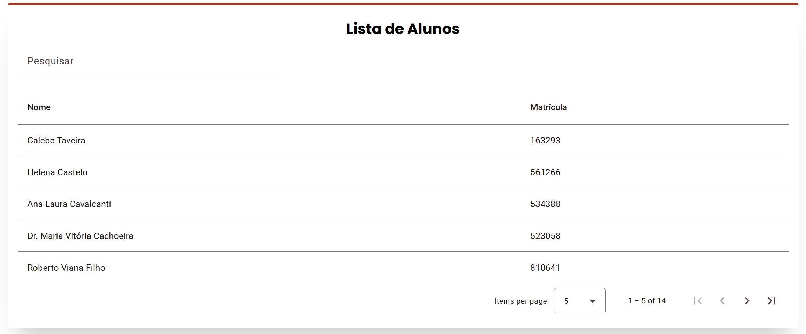

<Table>
  <tr>
    <td><a href= "https://www.cps.sp.gov.br/"></td>
    <td>
      <a href= "https://www.inteli.edu.br/"></a>
    </td>
  </tr>
</table>

# Nome do Projeto: GestorIN

## Nome do Grupo: IntegraEDU

## Integrantes:

- <a href="https://www.linkedin.com/in/calebe-matias/">Calebe Matias</a>
- <a href="https://www.linkedin.com/in/fernando-tavares-bertholdo/">Fernando Bertholdo</a>
- <a href="https://www.linkedin.com/in/kauanmassuia/">Kauan Massuia</a>
- <a href="https://www.linkedin.com/in/larissa-temoteo/">Larissa Temoteo</a>
- <a href="https://www.linkedin.com/in/marlos-do-carmo-guedes-366987250/">Marlos Guedes</a>
- <a href="https://www.linkedin.com/in/Matheus Ribeiro dos Santos">Matheus Ribeiro dos Santos</a>
- <a href="https://www.linkedin.com/in/renan-reis-483a10289/">Renan Reis</a>
- <a href="https://www.linkedin.com/in/vinicius-maciel-flor/">Vinicius Maciel</a>

# Sumário

- [1. Introdução](#1-introdução)
  - [1.1 Termos e Abreviações](#11-termos-e-abreviações)
  - [1.2 Objetivo do Documento](#12-objetivo-do-documento)
- [2. Entendimento do Projeto e do Negócio](#2-entendimento-do-projeto-e-do-negócio)
  - [2.1 Contexto da Indústria do Parceiro](#21-contexto-da-indústria-do-parceiro)
  - [2.2 Problema](#22-problema)
  - [2.3 Visão do Projeto e do Produto](#23-visão-do-projeto-e-do-produto)
  - [2.4 Personas e Jornada do Usuário](#24-personas-e-jornada-do-usuário)
  - [2.5 Modelagem do Fluxo de Negócio](#25-modelagem-do-fluxo-de-negócio)
    - [2.5.1 Fluxo de Negócio Atual (AS-IS)](#251-fluxo-de-negócio-atual-as-is)
    - [2.5.2 Fluxo de Negócio Proposto (TO-BE)](#252-fluxo-de-negócio-proposto-to-be)
  - [2.6 Matriz de Risco do Projeto](#26-matriz-de-risco-do-projeto)
  - [2.7 Ideação](#27-ideação)
    - [2.7.1 Brainstorming de features](#271-brainstorming-de-features)
    - [2.7.2 Sequenciamento/Priorização de entregas](#272-sequenciamentopriorização-de-entregas)
  - [2.8 Canvas do Projeto](#28-canvas-do-projeto)
- [3. Requisitos do Projeto](#3-requisitos-do-projeto)
  - [3.1 Requisitos Funcionais (RFs)](#31-requisitos-funcionais-rfs)
  - [3.2 Requisitos Não Funcionais (RNFs)](#32-requisitos-não-funcionais-rnfs)
  - [3.3 Correlação RFs e RNFs](#33-correlação-rfs-e-rnfs)
- [4. Modelagem de Dados](#4-modelagem-de-dados)
  - [4.1 Modelo Conceitual de Dados](#41-modelo-conceitual-de-dados)
  - [4.2 Modelo Lógico de Dados](#42-modelo-lógico-de-dados)
  - [4.3 Modelo Físico de Dados](#43-modelo-físico-de-dados)
- [5. Solução Técnica (Design)](#5-solução-técnica-design)
  - [5.1 Diagrama de Componentes da UML](#51-diagrama-de-componentes-da-uml)
  - [5.2 Diagramas de Sequência da UML](#52-diagramas-de-sequência-da-uml)
  - [5.3 Descrição Textual dos Diagramas](#53-descrição-textual-dos-diagramas)
- [6. Mapeamento Técnico de Infraestrutura e Implantação](#6-mapeamento-técnico-de-infraestrutura-e-implantação)
  - [6.1 Diagrama de Implantação da UML](#61-diagrama-de-implantação-da-uml)
  - [6.2 Justificativa das Escolhas de Implantação](#62-justificativa-das-escolhas-de-implantação)
  - [6.3 Considerações sobre Desempenho e Segurança](#63-considerações-sobre-desempenho-e-segurança)
- [7. Projeto Visual da Solução](#7-projeto-visual-da-solução)
  - [7.1 Desenvolvimento de Wireframes](#71-desenvolvimento-de-wireframes)
  - [7.2 Desenvolvimento de Mockups](#72-desenvolvimento-de-mockups)
  - [7.3 Guia Visual](#73-guia-visual)
- [8. Desenvolvimento do Projeto](#8-desenvolvimento-do-projeto)
  - [8.1 Arquitetura de Codificação e Estrutura de Diretórios](#81-arquitetura-de-codificação-e-estrutura-de-diretórios)
  - [8.2 Desenvolvimento de Features](#82-desenvolvimento-de-features)
    - [8.2.1 Sprint 3](#821-sprint-3)
    - [8.2.2 Sprint 4](#822-sprint-4)
    - [8.2.3 Sprint 5](#823-sprint-5)
  - [8.3 Testes Unitários e de Integração](#83-testes-unitários-e-de-integração)
  - [8.4 Documentações automáticas](#84-documentações-automáticas)
- [9. Planejamento e Execução de Testes](#9-planejamento-e-execução-de-testes)
  - [9.1 Testes Funcionais](#91-testes-funcionais)
    - [9.1.1 Planejamento](#911-planejamento)
    - [9.1.2 Resultados](#912-resultados)
  - [9.2 Testes de RNFs](#92-testes-de-rnfs)
    - [9.2.1 Planejamento](#921-planejamento)
    - [9.2.2 Resultados](#922-resultados)
  - [9.3 Testes de Usabilidade](#93-testes-de-usabilidade)
    - [9.3.1 Planejamento](#931-planejamento)
    - [9.3.2 Resultados](#932-resultados)
- [10. Procedimentos de Implantação](#10-procedimentos-de-implantação)
  - [10.1 Implantação e Configuração do Banco de Dados](#101-implantação-e-configuração-do-banco-de-dados)
  - [10.2 Implantação do Protótipo para uso por equipe de desenvolvimento](#102-implantação-do-protótipo-para-uso-por-equipe-de-desenvolvimento)
- [Referências](#referências)


# 1. Introdução
&nbsp;&nbsp;&nbsp;&nbsp;Neste documento é apresentado o desenvolvimento de um sistema para o Centro Paula Souza (CPS), com o objetivo de melhorar a gestão e o registro dos atendimentos prestados aos alunos que necessitam de suporte especial. Atualmente, o controle é realizado por meio de formulários e planilhas, o que torna o processo manual, sujeito a erros. O novo sistema visa digitalizar e otimizar essas operações, oferecendo uma solução integrada.

## 1.1 Termos e Abreviações

**CPS: Centro Paula Souza** – Instituição pública de ensino técnico e tecnológico.

**MEC: Ministério da Educação** – Órgão do governo responsável pela regulação da educação no Brasil.

**API: Interface de Programação de Aplicativos (Application Programming Interface)** – Conjunto de definições e protocolos para integração de sistemas.

**MVP: Produto Mínimo Viável (Minimum Viable Product)** – Versão inicial do produto com funcionalidades essenciais.

**LGPD: Lei Geral de Proteção de Dados** – Lei brasileira que controla a privacidade e o uso/tratamento de dados pessoais.

**RF:** Requisito Funcional

## 1.2 Objetivo do Documento
&nbsp;&nbsp;&nbsp;&nbsp;O objetivo deste documento é detalhar o entendimento do négocio, etapas do projeto e especificações técnicas de desenvolvimento do sistema de gestão para a Assessoria de Inclusão do Centro Paula Souza. Este documento servirá como referência para todo o processo, desde o planejamento até a implantação, garantindo que todos os stakeholders tenham uma visão clara dos objetivos, funcionalidades e expectativas em relação ao produto final. Além disso, estabelece as diretrizes para o desenvolvimento, testes, segurança e manutenção da solução, assegurando a entrega de um sistema eficiente, seguro e acessível.

# 2. Entendimento do Projeto e do Negócio

## 2.1 Contexto da Indústria do Parceiro
&nbsp;&nbsp;&nbsp;&nbsp;O Centro Paula Souza é uma das principais instituições de ensino técnico e tecnológico do Brasil, atuando em um setor que inclui escolas técnicas, faculdades públicas e privadas, além de cursos online. A aplicação das Cinco Forças de Porter ajuda a compreender seu posicionamento estratégico nesse cenário.

<div align="center">
  
  <sup>Figura 1 - Cinco Forças de Porter </sup>
  
  
  
  <sup>Fonte: Material produzido pelos autores (2024)</sup>
  
</div>

&nbsp;&nbsp;&nbsp;&nbsp;A ameaça de novos entrantes é considerada média. A criação de novas instituições exige infraestrutura, professores qualificados e credenciamento pelo MEC, o que representa uma barreira de entrada. No entanto, o crescimento de cursos técnicos privados e plataformas de ensino online tem facilitado a chegada de novos concorrentes. Apesar disso, o Centro Paula Souza mantém uma vantagem competitiva significativa devido à sua reputação consolidada, estrutura física abrangente e parcerias estratégicas com o setor produtivo e o governo.

&nbsp;&nbsp;&nbsp;&nbsp;O poder de barganha dos fornecedores é baixo. Como instituição pública, o Centro Paula Souza tem forte poder de negociação com fornecedores de materiais didáticos e tecnologia, além de contar com um corpo docente estável e qualificado. Essa estrutura reduz a dependência de insumos externos e garante maior controle sobre os custos e a qualidade do ensino oferecido.

&nbsp;&nbsp;&nbsp;&nbsp;O poder de barganha dos clientes, no caso os alunos, é alto. Com uma ampla oferta de cursos técnicos e superiores disponíveis no mercado, os estudantes podem optar por diversas instituições públicas e privadas, incluindo faculdades que oferecem bolsas de estudo e cursos online mais flexíveis. O diferencial do Centro Paula Souza está na oferta de ensino gratuito e na qualidade dos cursos, fatores que ajudam a atrair e reter alunos, garantindo que a instituição continue sendo uma opção competitiva.

&nbsp;&nbsp;&nbsp;&nbsp;A ameaça de produtos ou serviços substitutos é média. Alternativas como cursos online, capacitações empresariais e treinamentos oferecidos por plataformas de ensino à distância representam concorrência direta ao modelo tradicional de ensino técnico e tecnológico. No entanto, o Centro Paula Souza se diferencia ao oferecer uma formação prática e alinhada às demandas do mercado de trabalho, algo que muitas dessas alternativas não conseguem replicar com a mesma eficácia.

&nbsp;&nbsp;&nbsp;&nbsp;A rivalidade entre concorrentes é alta, já que o setor educacional é fragmentado e conta com muitas instituições disputando alunos. O Centro Paula Souza se destaca pela credibilidade, qualidade dos cursos e pelo alto índice de empregabilidade de seus formados, que ultrapassa 90% nas Fatecs. Além disso, as parcerias com o governo e o setor produtivo garantem a atualização constante dos currículos, mantendo os cursos alinhados com as necessidades do mercado.

&nbsp;&nbsp;&nbsp;&nbsp;Diante desse cenário, o Centro Paula Souza se mantém competitivo em um setor dinâmico e disputado graças à sua tradição, ensino gratuito e foco na formação prática. Esses fatores consolidam a instituição como uma referência nacional em educação técnica e tecnológica, garantindo sua relevância mesmo diante dos desafios impostos pela concorrência e pelas mudanças no setor educacional.

## 2.2 Problema
&nbsp;&nbsp;&nbsp;&nbsp;Atualmente, a Assessoria de Inclusão do Centro Paulo Souza (CPS) enfrenta desafios na gestão e registro dos atendimentos prestados aos alunos que necessitam de suporte especial. O controle dessas informações é feito por meio de formulários e planilhas, tornando o processo manual, suscetível a erros e dificultando tanto a organização quanto a obtenção de um histórico consolidado dos atendimentos.

&nbsp;&nbsp;&nbsp;&nbsp; Com isso, essa limitação impacta diretamente o Centro Paula Souza, pois a ausência de um sistema interativo impede o registro estruturado dos alunos em atendimento, do tipo de suporte prestado, do motivo do atendimento e do profissional responsável. Além disso, a falta de um histórico centralizado dificulta a análise de dados, como a quantidade de atendimentos realizados, os tipos de necessidades atendidas e a origem dos alunos. Consequentemente, esses desafios comprometem o acompanhamento adequado dos atendimentos, reduzem a eficiência operacional e dificultam a disponibilização de materiais assistivos e de profissionais especializados.

## 2.3 Visão do Projeto e do Produto

&nbsp;&nbsp;&nbsp;&nbsp;O projeto tem como objetivo criar uma solução digital para a Assessoria de Inclusão do Centro Paula Souza. Atualmente, a equipe trabalha com formulários digitais e planilhas para organizar os atendimentos dos alunos, o que pode gerar inconsistências, dificultar o acompanhamento dos casos e tornar o processo mais demorado.  

Com essa nova solução, buscamos centralizar todas as informações em um sistema mais organizado e acessível, garantindo um histórico detalhado dos atendimentos e facilitando a gestão dos recursos necessários. O sistema permitirá cadastrar alunos automaticamente via API, registrar e acompanhar atendimentos, além de oferecer relatórios estatísticos para melhorar a tomada de decisão.  

###  Objetivos do Produto  
- Melhorar a organização dos atendimentos da Assessoria de Inclusão.  
- Criar um histórico completo de atendimentos e necessidades dos alunos.  
- Facilitar o acesso e a atualização das informações pelos servidores.  
- Gerar dados estatísticos para apoiar a gestão e a alocação de recursos.  
- Garantir acessibilidade ao sistema para usuários que utilizam leitor de tela.  

###  O que o produto faz  
- Permite cadastrar e acompanhar atendimentos dos alunos.  
- Oferece relatórios estatísticos sobre os atendimentos.  
- Permite vincular alunos a profissionais e tecnologias assistivas.  
- Garante acessibilidade para leitores de tela.  

###  O que o produto NÃO faz  
- Não se integra com sistemas externos além dos definidos no escopo.  
- Não substitui completamente os sistemas acadêmicos do Centro Paula Souza.  
- Não realiza diagnósticos ou avaliações médicas dos alunos.  


  
## **2.4 Personas e Jornada do Usuário**

Uma persona é um perfil fictício que representa um tipo de usuário do seu projeto, criado com base em dados reais. Basicamente, é como se fosse um personagem que ajuda a entender melhor quem vai usar o produto ou serviço.

Elas são importantes porque ajudam a tomar decisões mais certeiras, garantindo que o projeto atenda às necessidades reais dos usuários. Com uma persona bem definida, é possível criar soluções mais intuitivas, melhorar a comunicação e focar no que realmente faz diferença para quem vai usar.

---

### **Pedro Henrique – Assessor**

&nbsp;&nbsp;&nbsp;&nbsp;Pedro Henrique é um assessor de 32 anos, extrovertido e comunicativo, que gosta de colaborar com sua equipe. Sua energia contagia os colegas e cria um ambiente mais dinâmico e acolhedor. Apesar de ter deficiência visual, ele é resiliente e persistente, sempre buscando soluções para superar desafios.

&nbsp;&nbsp;&nbsp;&nbsp;Uma de suas dificuldades é manter o mapeamento correto dos alunos, além de precisar de um sistema que seja acessível para pessoas com deficiência visual. Se a plataforma oferecer uma interface intuitiva e acessível, Pedro poderá desempenhar suas funções de forma mais eficiente, sem comprometer sua produtividade ou autonomia. Isso permitirá que ele se concentre mais em auxiliar a equipe na execução de tarefas operacionais e menos em dificuldades técnicas.

<div align="center">
  <sub>Figura xx - Persona 01 - Pedro Henrique </sub>
  <p align="center">

<br>
<sup>Fonte: Material produzido pelo grupo IntegraEDU (2025)</sup>
</div>

<div align="center">
  <sub>Figura xx - Jornada do Usuário 01 - Pedro Henrique </sub>
  <p align="center">

<br>
<sup>Fonte: Material produzido pelo grupo IntegraEDU (2025)</sup>
</div>

---

### **Jorge Matheus – Coordenador ETEC**

&nbsp;&nbsp;&nbsp;&nbsp;Jorge Matheus tem 43 anos e atua como Coordenador na FATEC. Ele é uma pessoa introvertida, prefere trabalhar em silêncio e em um ambiente climatizado. Apesar de sua vasta experiência na instituição, ele tem dificuldade em se adaptar a novas tecnologias.

&nbsp;&nbsp;&nbsp;&nbsp;Seu principal desafio é tornar os dados dos alunos mais acessíveis para análise, além de precisar registrar observações nas fichas dos alunos com deficiência. Como sua fluência tecnológica é mediana, ele pode enfrentar dificuldades ao lidar com sistemas modernos, o que pode impactar sua eficiência no uso da plataforma. Um sistema intuitivo, com dashboards analíticos e relatórios consolidados, ajudaria a otimizar suas atividades diárias e facilitar a tomada de decisões estratégicas.

<div align="center">
  <sub>Figura xx - Persona 02 - Jorge Matheus </sub>
  <p align="center">

<br>
<sup>Fonte: Material produzido pelo grupo IntegraEDU (2025)</sup>
</div>

<div align="center">
  <sub>Figura xx - Jornada do Usuário 02 - Jorge Matheus </sub>
  <p align="center">

<br>
<sup>Fonte: Material produzido pelo grupo IntegraEDU (2025)</sup>
</div>

---

### **Giovanna Haara – Psicóloga (Responsável pela Operação do Sistema)**

&nbsp;&nbsp;&nbsp;&nbsp;Giovanna Haara tem 38 anos e atua como psicóloga. Ela é uma pessoa introvertida, que prefere atividades mais introspectivas e aproveita seu tempo livre para se envolver em hobbies como leitura de livros, especialmente de ficção científica e mistério, escrita criativa e jogos.

&nbsp;&nbsp;&nbsp;&nbsp;Seu principal desafio é manter um histórico completo de todos os atendimentos realizados, o que exige organização e um sistema eficiente para registros. Apesar de utilizar redes sociais e ter conhecimentos básicos de informática, ela pode encontrar dificuldades ao lidar com plataformas mais complexas. Um sistema intuitivo, com funcionalidades para geração de relatórios e registros rápidos, ajudaria a otimizar sua rotina profissional e garantir a qualidade das informações.

<div align="center">
<sub>Figura xx - Persona 03 - Giovanna Haara </sub>
  <p align="center">

<br>
<sup>Fonte: Material produzido pelo grupo IntegraEDU (2025)</sup>
</div>

<div align="center">
  <sub>Figura xx - Jornada do Usuário 03 - Giovanna Haara </sub>
  <p align="center">

<br>
<sup>Fonte: Material produzido pelo grupo IntegraEDU (2025)</sup>
</div>

## 2.5 Modelagem do Fluxo de Negócio

&nbsp;&nbsp;&nbsp;&nbsp; A modelagem do fluxo de negócio é uma técnica utilizada para representar, de forma visual e descritiva, as etapas e atividades que compõem um processo empresarial. Ela tem como objetivo entender, analisar e otimizar os processos internos de uma organização, garantindo que as operações sejam executadas de maneira eficiente e alinhadas aos objetivos do negócio.

&nbsp;&nbsp;&nbsp;&nbsp; Esse mapeamento facilita a identificação de gargalos, redundâncias ou pontos de melhoria, além de servir como base para a implementação de sistemas e soluções tecnológicas que automatizam e aprimoram esses processos.

<div align="center">
  <sub>Figura xx - Modelagem do Fluxo do Negócio </sub>
  <p align="center">

<br>
<sup>Fonte: Material produzido pelo grupo IntegraEDU (2025)</sup>
</div>

## 2.5.1 Fluxo de Negócio Atual (AS-IS)
&nbsp;&nbsp;&nbsp;&nbsp; Atualmente, a *Assessoria de Inclusão do Centro Paula Souza (CPS)* enfrenta desafios significativos na gestão dos atendimentos aos alunos que necessitam de suporte especial. O fluxo de negócio é predominantemente manual, conforme descrito abaixo:

1. *Registro Manual de Atendimentos:*

   - Os atendimentos são registrados em *formulários impressos* e posteriormente inseridos em *planilhas eletrônicas*.
   - Não há padronização na coleta de dados, o que resulta em informações incompletas ou inconsistentes.

2. *Gerenciamento de Alunos e Profissionais:*

   - As informações dos alunos e profissionais são mantidas em *arquivos separados*, dificultando o cruzamento de dados e o acompanhamento do histórico de atendimentos.
   - O vínculo entre profissionais e alunos é feito manualmente, o que está sujeito a erros.

3. *Dificuldade na Análise de Dados:*

   - A falta de um sistema integrado impede a geração automática de *relatórios* e *gráficos* para análise dos atendimentos.
   - A consulta a dados históricos é demorada e trabalhosa, comprometendo a tomada de decisão.

4. *Problemas de Acessibilidade e Segurança:*

   - O uso de planilhas não oferece os *requisitos de segurança* adequados para proteger dados sensíveis.
   - Não há suporte adequado para *usuários com deficiência visual*, limitando a acessibilidade.

## 2.5.2 Fluxo de Negócio Proposto (TO-BE)
&nbsp;&nbsp;&nbsp;&nbsp; O fluxo de negócio proposto visa modernizar e otimizar a gestão dos atendimentos através da implementação de um *Sistema de Gerenciamento para a Assessoria de Inclusão*, conforme detalhado abaixo:

1. *Automatização do Registro de Atendimentos:*

   - Desenvolvimento de uma *interface web* para registro de atendimentos em tempo real.
   - Padronização dos dados coletados, garantindo maior precisão e consistência nas informações.

2. *Gestão Integrada de Alunos e Profissionais:*

   - *Vinculação centralizada* de alunos e profissionais, com possibilidade de edição e exclusão de registros.
   - Vínculo automático de profissionais aos alunos, facilitando o acompanhamento do suporte prestado.

3. *Geração de Relatórios e Análise de Dados:*

   - Ferramentas para *geração automática de relatórios, **gráficos* e *estatísticas* sobre atendimentos realizados, necessidades atendidas e origem dos alunos.
   - Sistema de *logs* para rastrear alterações no banco de dados.

4. *Melhorias em Acessibilidade e Segurança:*

   - Implementação de funcionalidades de *acessibilidade, como suporte a **leitores de tela*.
   - Adoção de *protocolos de segurança* para proteção de dados sensíveis, com *criptografia* e *autenticação segura*.

5. *Infraestrutura e Integração:*

   - O sistema será hospedado na *nuvem*, garantindo acessibilidade remota e alta disponibilidade.
   - *API* para integração com outros sistemas acadêmicos do CPS.

&nbsp;&nbsp;&nbsp;&nbsp; Essas melhorias garantirão maior eficiência operacional, segurança dos dados, facilidade na análise de informações e melhor experiência para os usuários, consolidando um ambiente de inclusão mais eficiente e estruturado.

## 2.6 Matriz de Risco do Projeto
&nbsp;&nbsp;&nbsp;&nbsp;Uma matriz de risco é uma ferramenta cuja função é identificar, avaliar e priorizar riscos dentro de uma organização. Ela fornece uma visualização clara dos potenciais problemas que podem impactar um projeto ou processo, classificando-os com base na probabilidade de ocorrência e na gravidade de suas consequências.

<div align="center">
  <sub>Figura X: Matriz de Risco</sub>
  
  <sup>Fonte: Elaborado por IntegraEDU</sup>
</div>

&nbsp;&nbsp;&nbsp;&nbsp;A seguir, identificaremos uma série de riscos que podem impactar negativamente o sucesso da solução. Esses riscos estão divididos em quatro categorias principais:

1. **Riscos Relacionados ao Parceiro:** Envolvem a colaboração com o Centro Paula Souza, incluindo possíveis diferenças nas expectativas.

2. **Riscos Relacionados ao Processo:** Referem-se à organização e execução das atividades do projeto, como planejamento desorganizado e dificuldades de comunicação e colaboração.

3. **Riscos Relacionados ao Grupo:** Incluem desafios internos enfrentados pela equipe, como falta de conhecimento técnico, dificuldade em manter o engajamento dos membros e problemas com a execução das tasks.

4. **Riscos Relacionados à Entrega de Valor:** Envolvem a capacidade de fornecer um produto final que atenda às necessidades e expectativas dos usuários, incluindo a manutenção e suporte pós-projeto e a qualidade do código entregue.

&nbsp;&nbsp;&nbsp;&nbsp;Abaixo, apresentamos uma matriz detalhada que descreve cada risco, sua probabilidade, impacto e as estratégias de mitigação propostas.

<div align="center">
  <sub>Tabela x: Análise da Matriz de Risco</sub>

| Risco                                                         | Descrição                                                                                                                   | Probabilidade | Impacto    | Mitigação                                                                                                                         |
| ------------------------------------------------------------- | --------------------------------------------------------------------------------------------------------------------------- | ------------- | ---------- | --------------------------------------------------------------------------------------------------------------------------------- |
| **Falta de presença de membros por condições de saúde**       | A ausência de membros devido a problemas de saúde pode afetar o progresso do projeto.                                         | 60%           | Moderado   | Garantir cobertura de tarefas entre os membros e otimizar a comunicação para facilitar o progresso durante ausências.           |
| **Aumento de escopo pela equipe conversando com o cliente**   | A equipe pode aumentar o escopo do projeto sem alinhamento claro com o cliente.                                               | 40%           | Alto       | Estabelecer um controle rigoroso do escopo e realizar reuniões regulares para alinhar as expectativas com o cliente.           |
| **Falta de conhecimento técnico**                             | A equipe pode não ter o conhecimento necessário para completar as tarefas corretamente, afetando o andamento do projeto.      | 30%           | Moderado   | Investir em treinamento contínuo e apoio entre os membros da equipe, utilizando recursos acadêmicos e especialistas do Centro Paula Souza. |
| **Dificuldade em manter o engajamento da equipe**             | A falta de motivação pode prejudicar o desempenho e o comprometimento dos membros da equipe.                                   | 50%           | Muito Alto | Promover atividades de integração e reconhecimento das contribuições dos membros.                                               |
| **Problemas com Git flow**                                    | Dificuldades com o uso adequado do Git flow podem levar a falhas no controle de versões e conflitos no código.               | 60%           | Alto       | Realizar treinamentos e revisões frequentes de boas práticas de versionamento de código.                                       |
| **Atraso na revisão de Pull Request**                         | Revisões tardias de Pull Requests podem resultar em atrasos na entrega das funcionalidades.                                   | 70%           | Alto       | Definir um processo claro para revisões rápidas e distribuir responsabilidades para garantir a agilidade nas entregas.        |
| **Entendimento errado dos requisitos**                        | A equipe pode interpretar os requisitos de forma incorreta, resultando em funcionalidades que não atendem às necessidades.     | 50%           | Muito Alto | Realizar reuniões frequentes com o cliente e a equipe para esclarecer requisitos e garantir alinhamento constante.            |
| **Tasks mal feitas geram bugs e erros no código**             | A falta de atenção nas tasks pode levar à introdução de bugs e problemas de estrutura no código.                             | 80%           | Muito Alto | Implementar um processo de revisão contínua de código, testes automatizados e análise de qualidade.                           |
| **Atrasos nas tasks por falta de revisão**                    | A falta de revisão nas tasks pode levar a problemas não detectados e atrasos nas entregas.                                   | 60%           | Alto       | Estabelecer checkpoints claros e prazos rígidos para a revisão de tasks.                                                      |
| **Danos em hardware desencadeando atrasos**                   | Falhas de hardware podem causar interrupções no andamento das atividades e atrasos nas entregas.                              | 30%           | Moderado   | Implementar estratégias de backup e manutenção preventiva de equipamentos.                                                     |
| **Vazamento de dados sensíveis**                              | Riscos de vazamento de informações confidenciais durante o desenvolvimento ou implementação.                               | 20%           | Muito Alto | Aplicar rigorosos controles de segurança e políticas de proteção de dados.                                                     |
| **Atrasos na implementação da infraestrutura tecnológica**   | Atrasos no setup da infraestrutura necessária para o projeto podem impedir o progresso das tasks e funcionalidades.         | 50%           | Alto       | Garantir planejamento antecipado e ações proativas para implementação da infraestrutura.                                      |
| **O produto ficar excepcional e se tornar portfólio para os membros** | A entrega de um produto excepcional pode elevar o perfil da equipe e ajudar a equipe a consolidar mais conhecimento.        | 80%           | Muito Alto | Envolver os membros em todas as etapas do desenvolvimento para que o aprendizado e as conquistas sejam bem documentadas e valorizadas. |

<sup>Fonte: Elaborado por IntegraEDU</sup>
</div>

&nbsp;&nbsp;&nbsp;&nbsp;Além dos riscos, é igualmente importante identificar e explorar as oportunidades que podem surgir ao longo do desenvolvimento do nosso projeto em parceria com o Centro Paula Souza. A matriz de oportunidade nos permite visualizar e planejar ações que possam agregar valor ao projeto, maximizando os benefícios e aprimorando a colaboração entre as partes envolvidas. Essas oportunidades estão distribuídas em quatro categorias principais:

1. **Oportunidades Relacionadas ao Parceiro:** Envolvem a possibilidade de desenvolver benefícios para a inovação, como a contribuição para implementar soluções inovadoras e a possibilidade de criação de novas patentes.

2. **Oportunidades Relacionadas ao Processo:** Referem-se à melhoria contínua dos processos de trabalho, incluindo maior eficiência operacional, melhor comunicação e redução de erros humanos.

3. **Oportunidades Relacionadas ao Grupo:** Incluem o desenvolvimento das habilidades da equipe, tanto no aspecto técnico quanto nas soft skills, aumentando a performance do time.

4. **Oportunidades Relacionadas à Entrega de Valor:** Envolvem a criação de um produto final que não só atenda, mas supere as expectativas dos usuários, além da possibilidade de escalar a solução para outros contextos e áreas de atuação.

## 2.7 Ideação

## 2.7.1 Brainstorming de features
# Sistema de Gerenciamento para a Assessoria de Inclusão - MVP

## Visão Geral
Sistema para gerenciar atendimentos da Assessoria de Inclusão do Centro Paula Souza, permitindo controle de alunos atendidos, profissionais envolvidos e registros detalhados de cada atendimento.

## Funcionalidades do MVP
### Gestão de Alunos
- Pesquisar pela matrícula do aluno.
- Editar informações do aluno.
- Aplicar filtros de pesquisa (exemplo: buscar alunos por necessidade especial).
- Registrar se o aluno possui deficiência e qual o tipo.
- Registrar a origem dos alunos.

### Cadastro de Profissionais
- Cadastro, edição, listagem e remoção de profissionais.
- Vincular profissionais a alunos para acompanhamento.

### Registro e Logs
- Sistema de logs para rastrear mudanças no banco de dados.
- Registro de atendimentos com data de início e fim.

### Acessibilidade
- Suporte a leitores de tela para usuários com deficiência visual.

## Infraestrutura
- Interface web acessível e responsiva.
- API para integração com os sistemas acadêmicos do CPS.
- Banco de dados para armazenar registros e logs.

## Relatórios, Gráficos e Estatísticas
- Gerar relatórios sobre tipos de atendimento prestados, alunos atendidos e profissionais envolvidos.
- Gráficos sobre os dados das unidades / região.

## 2.7.2 Sequenciamento/Priorização de entregas

&nbsp;&nbsp;&nbsp;&nbsp;Para garantir que o sistema atenda às necessidades da Assessoria de Inclusão de forma eficiente, as funcionalidades foram priorizadas com base em três critérios principais: **urgência**, **viabilidade técnica** e **impacto**. Dessa forma, as entregas são organizadas de maneira estratégica, focando primeiro no que é mais essencial e viável, enquanto melhorias futuras são planejadas.

### **Critérios de Priorização**

1. **Urgência**: Funcionalidades que resolvem problemas imediatos ou que são críticas para o funcionamento do sistema. Por exemplo, o cadastro de profissionais e o registro de atendimentos são urgentes porque são a base do trabalho da Assessoria de Inclusão.
   
2. **Viabilidade Técnica**: Funcionalidades que podem ser implementadas com menos esforço e dependências técnicas. Por exemplo, a criação de um sistema de logs é viável porque depende apenas da infraestrutura básica do banco de dados.

3. **Impacto**: Funcionalidades que trazem benefícios significativos para os usuários. Por exemplo, a geração de relatórios e gráficos tem um alto impacto porque permite à equipe analisar dados e tomar decisões mais informadas.

### **Funcionalidades Prioritárias**

| **Funcionalidade**                     | **Urgência** | **Viabilidade Técnica** | **Impacto** | **Prioridade** | **Justificativa**                                                                 |
|----------------------------------------|--------------|-------------------------|-------------|----------------|----------------------------------------------------------------------------------|
| **Cadastro e Edição de Profissionais** | Alta         | Baixa                   | Alto        | Alta           | Base para vincular profissionais aos alunos e registrar atendimentos.             |
| **Registro de Atendimentos**           | Alta         | Média                   | Alto        | Alta           | Essencial para documentar cada atendimento, incluindo datas e profissionais.      |
| **Pesquisa e Filtros de Alunos**       | Alta         | Média                   | Alto        | Alta           | Facilita a busca de alunos por matrícula, necessidades especiais ou outros critérios. |
| **Sistema de Logs**                    | Média        | Média                   | Médio       | Média          | Permite rastrear alterações no banco de dados, garantindo transparência e segurança. |
| **Acessibilidade (Suporte a Leitores de Tela)** | Média | Média                   | Alto        | Média          | Garante que o sistema seja inclusivo e acessível a todos os usuários.            |
| **Relatórios e Gráficos**              | Média        | Alta                    | Alto        | Média          | Permite à equipe visualizar dados de atendimentos, alunos e profissionais de forma clara. |
| **API para Integração com Sistemas do CPS** | Baixa | Alta                    | Alto        | Baixa          | Facilita a importação e exportação de dados entre sistemas, mas requer alto esforço técnico. |
| **Editar Informações do Aluno**        | Média        | Baixa                   | Médio       | Baixa          | Permite atualizar dados dos alunos, mas é uma extensão do cadastro básico.        |
| **Vincular Profissionais a Alunos**    | Média        | Média                   | Médio       | Média          | Acompanha qual profissional está responsável por cada aluno, melhorando a organização. |
| **Registrar a Origem dos Alunos**      | Baixa        | Baixa                   | Baixo       | Baixa          | Informação útil, mas não crítica para o funcionamento inicial.                    |
| **Interface Web Acessível e Responsiva** | Média | Média                   | Médio       | Média          | Garante que o sistema funcione em diferentes dispositivos e navegadores.          |
| **Banco de Dados para Armazenar Registros e Logs** | Alta | Baixa                   | Alto        | Alta           | Base para todas as funcionalidades, garantindo o armazenamento seguro das informações. |
| **Gráficos sobre os Dados das Unidades/Região** | Média | Alta                    | Médio       | Média          | Permite visualizar estatísticas de atendimento e distribuição geográfica dos alunos. |


## **Roadmap de Entregas**

### **Fase 1 - Infraestrutura e Cadastro (Versão 1.0)**
- **Banco de Dados**: Estrutura básica para armazenar informações de alunos, profissionais e atendimentos.
- **Interface Web**: Layout inicial, responsivo e acessível.
- **Cadastro de Profissionais**: Funcionalidades básicas de inserção, edição e listagem.

### **Fase 2 - Funcionalidades Essenciais (Versão 1.1)**
- **Pesquisa e Filtros de Alunos**: Busca por matrícula e filtros avançados.
- **Registro de Atendimentos**: Inclusão de datas, profissionais envolvidos e detalhes do atendimento.
- **Sistema de Logs**: Rastreamento de alterações no banco de dados.

### **Fase 3 - Acessibilidade e Segurança (Versão 1.2)**
- **Acessibilidade**: Implementação de suporte a leitores de tela e testes de usabilidade.
- **Melhorias na Interface**: Ajustes para garantir compatibilidade com navegação por teclado e comandos de voz.

### **Fase 4 - Relatórios e Integração (Versão 1.3)**
- **Relatórios e Gráficos**: Geração de relatórios sobre atendimentos, alunos e profissionais.
- **API de Integração**: Conexão com sistemas acadêmicos do CPS para importação/exportação de dados.


## 2.8 Canvas do Projeto
&nbsp;&nbsp;&nbsp;&nbsp; O Canvas MVP é uma ferramenta visual para validar a viabilidade de um projeto, identificando os principais elementos que compõem a solução e como eles se relacionam. Ele foi idealizado por Paulo Caroli, autor do livro "Lean Inception", e é amplamente utilizado em metodologias ágeis para auxiliar equipes a definir e alinhar o escopo de um projeto de forma colaborativa.
Aqui, utilizaremos o Canvas MVP para mapear os principais aspectos do nosso projeto, incluindo a proposta de valor, os segmentos de clientes, as funcionalidades, os recursos necessários e as métricas de sucesso. 

<div align="center">
  <sub>Figura XX - Canvas do MVP </sub>
  <p align="center">

<br>
<sup>Fonte: Material produzido pelo grupo IntegraEDU, com base no boilerplate dispinibilizado em https://caroli.org/en/wp-content/uploads/sites/5/2019/07/MVP_Canvas_A1.pdf</sup>
</div>

&nbsp;&nbsp;&nbsp;&nbsp; A seguir, detalhamos os principais aspectos que compõem o MVP, conforme representado no Canvas:
1. **Proposta do MVP:** Um sistema de gerenciamento para a Assessoria de Inclusão do Centro Paula Souza, que permita o controle de atendimentos, alunos e profissionais de saúde envolvidos. O sistema deverá suprir as necessidades de registro e acompanhamento dos alunos, bem como associação ao respectivo profissional responsável.
2. **Personas Segmentadas:** Conforme já citados na seção [2.4 (Personas e Jornada do Usuário)](#24-personas-e-jornada-do-usuário), as personas Pedro Henrique, Jorge Matheus e Giovanna Haara representam os principais usuários da solução, pois atuam no fluxo de acompanhamento e gestão dos alunos atendidos pela Assessoria de Inclusão.
3. **Funcionalidades:** O MVP permitirá pesquisar alunos, cadastrar profissionais, editar informações prévias dos alunos, adicionar observações, anexar documentos, filtrar pesquisas por necessidades especiais, suporte a leitores de tela e registro de logs para rastrear mudanças no banco de dados.
4. **Custo e Cronograma:** O desenvolvimento do MVP será dividido em sprints de 2 semanas, com um total de 5 sprints para a entrega do produto final. O grupo estimou um custo de U$ 25.31/mês com infraestrutura em nuvem após a conclusão do projeto, considerando a instância mínima sob demanda da AWS (Amazon Web Services) ativa por 16h/dia. Além disso, para o desenvolvimento completo do MVP, considerando um time de 7 desenvolvedores e 1 Scrum Master, o custo de desenvolvimento ficou estimado em R$ 106.000,00, levando em conta uma média salarial de R$ 5.500 por desenvolvedor.
5. **Resultado Esperado:** O MVP deverá atender às necessidades básicas de registro e acompanhamento dos alunos atendidos pela Assessoria de Inclusão, permitindo a gestão eficiente dos atendimentos e a geração de relatórios para análise de dados. A solução deve ser acessível, responsiva e compatível com leitores de tela, garantindo a inclusão de usuários com deficiência visual.
6. **Métricas de Sucesso:** As métricas de sucesso incluem a satisfação dos stakeholders nas reviews de cada Sprint e, principalmente, na Sprint de entrega final e as notas dos artefatos corrigidos pelos professores.
7. **Jornada do Usuário:** A jornada do usuário foi mapeada para as personas Pedro Henrique, Jorge Matheus e Giovanna Haara, identificando os pontos de contato com a solução e as etapas do processo de atendimento e acompanhamento dos alunos.

# 3. Requisitos do Projeto

&emsp;Nesta seção, serão abordados os aspectos técnicos da solução, sendo eles os requisitos e a arquitetura da solução. Ao desenvolver uma solução que necessite de um software, é necessário construir a arquitetura do software, pois ela é a base de todas as features e características que serão entregues no protótipo final. Ainda assim, antes da construção da arquitetura de software, é imprescindível fazer o levantamento de requisitos funcionais e não funcionais, ou seja, listar o conjunto de especificações que a solução final deve ter tanto em ações quanto em características. Dessa forma, os requisitos serão o fundamento da arquitetura de software e regerão as regras de negócios e funcionamento do produto.

## 3.1 Requisitos Funcionais (RFs)
&emsp;Os requisitos funcionais de um software são ações e funções que ele deve conter. Nesse sentido, esses requisitos dizem respeito a o que a solução deve fazer, muitas vezes percebendo as funcionalidades do sistema do ponto de vista do usuário final. Assim, quanto mais diretos e claros forem os requisitos funcionais, melhor foram definidos e melhor auxiliarão no desenvolvimento da arquitetura de software.

&emsp;Os requisitos funcionais da solução estão listados abaixo, com cada requisito funcional identificado com o formato RFXX e documentado de forma clara e detalhada, alinhado-os às necessidades do negócio e expectativas dos usuários:

<div align="center">
  <sub>Tabela XX: Requisitos Funcionais</sub>

| RF##   | Descrição                                                                                       | Testes Necessários                                                                                   |
|-------|-------------------------------------------------------------------------------------------------|----------------------------------------------------------------------------------------------------|
| **RF01**  | O usuário deve ser capaz de editar e consultar os dados dos alunos.                                | **Pré-condição:** Aluno cadastrado no sistema. **Procedimento:** Acessar o registro do aluno, editar campos específicos e salvar. **Resultado Esperado:** Alterações salvas e visíveis ao consultar novamente. **Pós-condição:** Dados do aluno atualizados corretamente no sistema. |
| **RF02**  | O usuário deve ser capaz de pesquisar alunos por filtros como nome, matrícula e unidade.          | **Pré-condição:** Existência de alunos cadastrados. **Procedimento:** Utilizar filtros de pesquisa e verificar os resultados. **Resultado Esperado:** Retorno de resultados corretos com base nos filtros aplicados. **Pós-condição:** Resultados da pesquisa exibidos corretamente. |
| **RF03**  | O sistema deve registrar o histórico de alterações dos dados dos alunos.                          | **Pré-condição:** Aluno com dados anteriores registrados. **Procedimento:** Alterar informações do aluno e consultar o histórico. **Resultado Esperado:** Histórico de alterações contendo detalhes das mudanças. **Pós-condição:** Histórico atualizado refletindo as alterações feitas. |
| **RF04**  | O usuário deve ser capaz de registrar atendimentos, incluindo data, profissional responsável e tipo de atendimento. | **Pré-condição:** Profissional e aluno cadastrados. **Procedimento:** Preencher e submeter um novo atendimento. **Resultado Esperado:** Atendimento registrado corretamente no sistema. **Pós-condição:** Atendimento associado ao aluno e visível no histórico de atendimentos. |
| **RF05**  | O usuário deve ser capaz de vincular tecnologias assistivas e profissionais ao acompanhamento do aluno. | **Pré-condição:** Tecnologia assistiva e profissional cadastrados. **Procedimento:** Associar tecnologia e profissional ao aluno. **Resultado Esperado:** Associação registrada e visível no perfil do aluno. **Pós-condição:** O aluno vinculado corretamente à tecnologia e ao profissional. |
| **RF06**  | O usuário deve ser capaz de registrar observações adicionais sobre o aluno.                        | **Pré-condição:** Aluno cadastrado. **Procedimento:** Inserir uma nova observação no perfil do aluno. **Resultado Esperado:** Observação registrada e associada ao aluno. **Pós-condição:** Observação salva no histórico do aluno. |
| **RF07**  | O usuário deve ser capaz de editar registros de atendimentos anteriores, mantendo um log de alterações. | **Pré-condição:** Atendimento previamente registrado. **Procedimento:** Editar o atendimento e verificar o log de alterações. **Resultado Esperado:** Alteração refletida no atendimento com registro no log. **Pós-condição:** Histórico de alterações atualizado. |
| **RF08**  | O usuário deve ser capaz de anexar documentos e laudos médicos aos registros de atendimento.       | **Pré-condição:** Atendimento registrado para um aluno. **Procedimento:** Anexar documento ao atendimento e salvar. **Resultado Esperado:** Documento visível e acessível no registro do atendimento. **Pós-condição:** Documento associado ao registro de atendimento. |
| **RF09**  | O sistema deve ser capaz de cadastrar profissionais via API de registro do CPS.                   | **Pré-condição:** API do CPS disponível. **Procedimento:** Submeter dados de um novo profissional para cadastro. **Resultado Esperado:** Profissional cadastrado e visível na lista de profissionais. **Pós-condição:** Profissional adicionado com sucesso ao banco de dados. |
| **RF10**  | O usuário deve ser capaz de vincular profissionais a alunos para acompanhamento.                   | **Pré-condição:** Profissional e aluno cadastrados. **Procedimento:** Criar um vínculo de acompanhamento entre eles. **Resultado Esperado:** Vínculo registrado e visível no sistema. **Pós-condição:** Vínculo salvo e associado ao aluno. |
| **RF11**  | O usuário deve ser capaz de cadastrar novos tipos de tecnologia assistiva.                        | **Pré-condição:** Acesso administrativo ao sistema. **Procedimento:** Inserir e salvar novo tipo de tecnologia assistiva. **Resultado Esperado:** Tecnologia cadastrada com sucesso e disponível para uso. **Pós-condição:** Nova tecnologia disponível no sistema. |
| **RF12**  | O sistema deve restringir a exclusão de tecnologias já vinculadas a alunos.                       | **Pré-condição:** Tecnologia vinculada a um aluno. **Procedimento:** Tentar excluir uma tecnologia vinculada. **Resultado Esperado:** Sistema impede a exclusão e exibe mensagem de erro. **Pós-condição:** Tecnologia permanece associada ao aluno. |
| **RF13**  | O usuário deve ser capaz de associar mais de um tipo de tecnologia assistiva ao mesmo aluno.       | **Pré-condição:** Tecnologias assistivas cadastradas. **Procedimento:** Associar múltiplas tecnologias ao mesmo aluno. **Resultado Esperado:** Associações salvas corretamente e visíveis no perfil do aluno. **Pós-condição:** Vínculos múltiplos de tecnologia registrados. |
| **RF14**  | O sistema deve ser capaz de gerar relatórios sobre atendimentos prestados, alunos e profissionais envolvidos. | **Pré-condição:** Dados de atendimentos registrados. **Procedimento:** Gerar relatório e revisar dados apresentados. **Resultado Esperado:** Relatório gerado corretamente com informações atualizadas. **Pós-condição:** Relatório disponível para download ou consulta. |
| **RF15**  | O sistema deve ser compatível com leitores de tela para acessibilidade.                           | **Pré-condição:** Leitor de tela configurado (ex: NVDA). **Procedimento:** Navegar pelo sistema utilizando o leitor de tela. **Resultado Esperado:** Compatibilidade total com feedback de leitura adequado. **Pós-condição:** Sistema validado para acessibilidade. |
| **RF16**  | O sistema deve apresentar elementos de interface com contraste adequado para acessibilidade.      | **Pré-condição:** Interface configurada com temas padrão. **Procedimento:** Verificar contraste em diferentes seções do sistema. **Resultado Esperado:** Contraste adequado para leitura, conforme padrões de acessibilidade. **Pós-condição:** Interface validada para usuários com deficiência visual. |
| **RF17**  | O sistema deve permitir a navegação completa por teclado.                                        | **Pré-condição:** Sistema acessado com teclado sem uso do mouse. **Procedimento:** Navegar por todas as funcionalidades usando apenas o teclado. **Resultado Esperado:** Navegação fluida e acessível. **Pós-condição:** Sistema operacionalmente acessível via teclado. |
| **RF18**  | O sistema deve implementar autenticação e controle de permissões de acesso.                      | **Pré-condição:** Configurações de permissões de usuários definidas. **Procedimento:** Realizar login com diferentes níveis de acesso e tentar acessar recursos restritos. **Resultado Esperado:** Restrições aplicadas corretamente com base nas permissões. **Pós-condição:** Acesso controlado e seguro. |
| **RF19**  | O sistema deve garantir conformidade com a LGPD para armazenamento de dados sensíveis.            | **Pré-condição:** Dados sensíveis armazenados no sistema. **Procedimento:** Verificar políticas de segurança, criptografia e controle de acesso. **Resultado Esperado:** Conformidade com requisitos da LGPD. **Pós-condição:** Sistema seguro e em conformidade com a legislação. |
| **RF20**  | O sistema deve registrar logs de atividades dos usuários.                                        | **Pré-condição:** Acesso de usuários ao sistema. **Procedimento:** Realizar ações diversas e consultar o log de atividades. **Resultado Esperado:** Todas as ações registradas com data, hora e usuário. **Pós-condição:** Log completo e atualizado para auditoria. |
| **RF21**  | O sistema deve definir níveis de acesso hierárquicos para cada tipo de usuário.                   | **Pré-condição:** Perfis de usuário configurados. **Procedimento:** Testar acesso de diferentes usuários com níveis distintos de permissões. **Resultado Esperado:** Usuários acessam apenas funcionalidades permitidas. **Pós-condição:** Sistema seguro e funcional para diferentes perfis. |

  <sup>Fonte: Elaborado pela equipe do projeto</sup>
</div>


Cada RF está associado a testes específicos que garantem sua validação, com detalhes sobre:
- **Pré-condição:** Estado inicial do sistema.
- **Procedimento de Teste:** Passos para execução do teste.
- **Resultado Esperado:** Resultado previsto após o teste.
- **Pós-condição:** Estado esperado do sistema após o teste.


&emsp;Esta tabela cobre os principais requisitos funcionais do projeto, alinhados às regras de negócio e garantindo que a solução suporte as necessidades da CPS de organização do atendimento, fornecimento de histórico de atendimentos, provendo dados estatísticos sobre o total de atendimentos visando um aumento da agilidade no trâmite de solicitações e no fornecimento de materiais assistivos e/ou profissionais, conforme proposto pela empresa parceira.

## 3.2 Requisitos Não Funcionais (RNFs)

### 3.2.1 Introdução  
Os requisitos não funcionais definem as características de qualidade que o sistema deve atender para garantir um funcionamento adequado. Eles não descrevem funcionalidades específicas, mas sim aspectos como desempenho, segurança, acessibilidade e usabilidade. No contexto deste projeto, esses requisitos são essenciais para assegurar que a solução seja eficiente, confiável e atenda às necessidades dos usuários da Assessoria de Inclusão.

<div align="center">
  <sub>Tabela 1: Requisitos Não Funcionais</sub>

| **Código**  | **Requisito Não Funcional (RNF)**       | **Descrição**                                                                                                                                                         | **Métrica de Qualidade** |
|------------ | -------------------------------------- | --------------------------------------------------------------------------------------------------------------------------------------------------------------------- | ------------------------- |
| **RNF001**  | Plataforma em Nuvem                   | O sistema deve ser baseado em nuvem, garantindo acessibilidade remota sem dependência de um provedor específico.                                                     | Disponibilidade mínima de **95%**. |
| **RNF002**  | Integração via API                     | A API deve permitir a **associação de alunos com profissionais de saúde**, garantindo que todas as operações sejam registradas corretamente.                        | Tempo de resposta da API **≤ 1s**. |
| **RNF003**  | Desempenho                             | O tempo de resposta para operações críticas (login, consultas no dashboard e associação de alunos a profissionais) deve ser rápido e consistente.                    | Tempo médio de resposta **≤ 3s**. |
| **RNF004**  | Escalabilidade                         | O sistema deve ser capaz de suportar múltiplos acessos simultâneos sem degradação perceptível no desempenho.                                                          | Suporte a no mínimo **10 usuários simultâneos**. |
| **RNF005**  | Acessibilidade                         | O sistema deve seguir as diretrizes **WCAG 2.1**, garantindo acessibilidade para usuários com deficiência visual.                                                     | A interface deve ser compatível com leitores de tela. |
| **RNF006**  | Segurança e Privacidade                | O sistema deve garantir a proteção dos dados dos usuários, utilizando criptografia para armazenamento de informações sensíveis e protocolos seguros na comunicação.  | Dados sensíveis devem ser armazenados com **criptografia padrão do mercado** (ex: AES, SHA). Comunicação via **HTTPS/TLS 1.2+**. |
| **RNF007**  | Autenticação Segura                    | A API deve implementar um mecanismo de autenticação seguro para garantir que apenas usuários autorizados possam realizar operações.                                  | Implementação de **autenticação baseada em token** (exemplo: OAuth 2.0, JWT ou equivalente). |
| **RNF008**  | Logs de Auditoria                      | O sistema deve registrar ações críticas para garantir rastreabilidade e conformidade com normas de segurança.                                                         | Armazenamento de logs por no mínimo **30 dias**. |
| **RNF009**  | Interface e Experiência do Usuário     | O dashboard deve apresentar informações de forma clara, utilizando gráficos e indicadores visuais intuitivos.                                                         | Tempo de carregamento do dashboard **≤ 3s**. |
| **RNF010**  | Responsividade                         | A interface deve ser responsiva e garantir boa usabilidade em dispositivos desktop e móveis.                                                                         | Compatibilidade total com telas **≥ 5”**. |
| **RNF011**  | Tratamento de Erros na API             | A API deve fornecer mensagens de erro claras e detalhadas para facilitar a resolução de problemas na integração.                                                      | Mensagens de erro padronizadas e documentadas. |
| **RNF012**  | Documentação da API                    | A API deve ter documentação completa e acessível para facilitar a implementação e uso por outros sistemas.                                                           | Documentação deve estar disponível e atualizada. |

  <sup>Fonte: Elaborado pela equipe do projeto</sup>
</div>

## 3.3 Correlação RFs e RNFs

Os requisitos funcionais (RFs) e não funcionais (RNFs) do sistema GestorIN estão interligados para garantir que a solução atenda tanto às necessidades operacionais quanto aos padrões de qualidade exigidos. A tabela a seguir apresenta a correlação entre os requisitos, evidenciando como os RNFs suportam e complementam a implementação dos RFs.

<div align="center">
  <sub>Tabela 2: Correlação entre RFs e RNFs</sub>

| **Requisito Funcional (RF)**  | **Descrição**                                                                                     | **Requisitos Não Funcionais Relacionados (RNFs)**                                            |
|------------------------------|-------------------------------------------------------------------------------------------------|---------------------------------------------------------------------------------------------|
| **RF01**                      | Cadastro de alunos via API integrada com o CPS                                                 | RNF002 (Integração via API), RNF006 (Segurança e Privacidade), RNF012 (Documentação da API) |
| **RF02**                      | Edição e consulta de dados dos alunos                                                          | RNF003 (Desempenho), RNF009 (Interface e UX)                                               |
| **RF03**                      | Pesquisa de alunos por filtros como nome, matrícula e unidade                                 | RNF003 (Desempenho), RNF009 (Interface e UX)                                               |
| **RF04**                      | Registro do histórico de alterações nos dados dos alunos                                      | RNF008 (Logs de Auditoria), RNF006 (Segurança e Privacidade)                               |
| **RF05**                      | Registro de atendimentos, incluindo data, profissional e tipo de atendimento                 | RNF001 (Plataforma em Nuvem), RNF003 (Desempenho), RNF008 (Logs de Auditoria)              |
| **RF06**                      | Associação de tecnologias assistivas e profissionais ao aluno                                | RNF003 (Desempenho), RNF004 (Escalabilidade)                                               |
| **RF07**                      | Registro de observações adicionais sobre o aluno                                             | RNF006 (Segurança e Privacidade), RNF008 (Logs de Auditoria)                               |
| **RF08**                      | Edição de registros de atendimentos anteriores mantendo um log de alterações                | RNF008 (Logs de Auditoria), RNF006 (Segurança e Privacidade)                               |
| **RF09**                      | Anexação de documentos e laudos médicos aos registros de atendimento                         | RNF006 (Segurança e Privacidade), RNF004 (Escalabilidade)                                  |
| **RF10**                      | Cadastro de profissionais via API integrada com o CPS                                       | RNF002 (Integração via API), RNF006 (Segurança e Privacidade), RNF012 (Documentação da API) |
| **RF11**                      | Vinculação de profissionais a alunos para acompanhamento                                    | RNF004 (Escalabilidade), RNF006 (Segurança e Privacidade)                                  |
| **RF14**                      | Cadastro de novos tipos de tecnologia assistiva                                             | RNF005 (Acessibilidade), RNF010 (Responsividade)                                           |
| **RF15**                      | Restrição à exclusão de tecnologias já vinculadas a alunos                                 | RNF006 (Segurança e Privacidade)                                                           |
| **RF16**                      | Associação de múltiplas tecnologias assistivas a um mesmo aluno                            | RNF004 (Escalabilidade)                                                                    |
| **RF18**                      | Geração de relatórios sobre atendimentos e alunos                                          | RNF009 (Interface e UX), RNF003 (Desempenho)                                              |
| **RF21**                      | Compatibilidade com leitores de tela para acessibilidade                                  | RNF005 (Acessibilidade)                                                                    |
| **RF22**                      | Interface com contraste adequado para acessibilidade                                       | RNF005 (Acessibilidade)                                                                    |
| **RF23**                      | Navegação completa por teclado                                                             | RNF005 (Acessibilidade)                                                                    |
| **RF25**                      | Implementação de autenticação e controle de permissões de acesso                          | RNF007 (Autenticação Segura), RNF006 (Segurança e Privacidade)                             |
| **RF26**                      | Conformidade com a LGPD para armazenamento de dados sensíveis                             | RNF006 (Segurança e Privacidade)                                                           |
| **RF27**                      | Registro de logs de atividades dos usuários                                               | RNF008 (Logs de Auditoria)                                                                 |
| **RF29**                      | Definição de níveis de acesso hierárquicos para cada tipo de usuário                      | RNF007 (Autenticação Segura), RNF006 (Segurança e Privacidade)                             |

</div>

Essa correlação demonstra como os requisitos funcionais são sustentados por características técnicas e operacionais estabelecidas nos requisitos não funcionais, garantindo uma implementação robusta e alinhada às necessidades do projeto.

# 4. Modelagem de Dados

## 4.1 Modelo Conceitual de Dados

O modelo conceitual de dados representa as entidades e seus relacionamentos de forma abstrata, independente das tecnologias de implementação. Ele descreve os elementos essenciais do domínio de negócios, facilitando a compreensão de como as diferentes entidades se conectam e interagem no sistema.

No caso do sistema de gestão escolar, o modelo conceitual abrange as principais entidades, como usuários, escolas, alunos, profissionais, equipamentos, atendimentos e casos. E define os atributos necessários para armazenar informações detalhadas sobre cada uma dessas entidades e os tipos de relacionamento entre elas.

O modelo conceitual serve como a base para o desenvolvimento do modelo lógico e a implementação do banco de dados, garantindo que a estrutura de dados atenda aos requisitos de negócios e suporte a evolução do sistema.

<div align="center">
  
  <sup>Figura X - Modelo Conceitual de Dados </sup>
  
  
  
  <sup>Fonte: Material produzido pelo grupo IntegraEDU (2025)</sup> 
</div>

### Entidades
- **Usuario**
  - **Atributos**: id, escola_id, nome, email, senha, tipo
  - **Descrição**: Representa os usuários do sistema, com diferentes tipos de acesso.
  - **Regra de Negócio**: O tipo de usuário determina as permissões e acessos dentro do sistema. Um usuário administrador pode gerenciar todas as escolas, quanto um gestor tem acesso apenas à sua escola. Um profissional tem acesso restrito aos casos e atendimentos. 

- **Escola**
  - **Atributos**: id, nome, cnpj, endereco
  - **Descrição**: Representa as escolas associadas ao sistema.
  - **Regra de Negócio**: Uma escola pode ter múltiplos Atendimentos, Alunos e Equipamentos, mas é associada a um único gestor. Cada escola é registrada no sistema com CNPJ único.

- **Aluno**
  - **Atributos**: id, escola_id, nome, tipo_deficiencia, necessidades
  - **Descrição**: Representa os alunos matriculados nas escolas, com informações sobre necessidades específicas.
  - **Regra de Negócio**: Cada aluno pode ter um ou mais casos registrados, dependendo das necessidades. Os alunos são vinculados a uma escola por escola_id.

- **Profissional**
  - **Atributos**: id, nome, especialidade, contato
  - **Descrição**: Representa os profissionais que realizam atendimentos e acompanham casos.
  - **Regra de Negócio**: Um profissional pode estar associado a diversos casos e atendimentos, podendo ser especializado em diferentes áreas.

- **Equipamento**
  - **Atributos**: id, escola_id, nome, descricao
  - **Descrição**: Representa os equipamentos disponíveis nas escolas para uso dos alunos.
  - **Regra de Negócio**: O equipamento é alocado para alunos conforme necessidade e disponibilidade. Deve haver controle de uso para manutenção.

- **Atendimento**
  - **Atributos**: id, escola_id, data_inicio, data_fim, aluno_id, profissional_id, descricao
  - **Descrição**: Representa os atendimentos realizados por profissionais para os alunos.
  - **Regra de Negócio**: Cada atendimento tem um aluno_id e um profissional_id específicos. A data de data_inicio e data_fim são controladas para evitar sobreposição de atendimentos.

- **Caso**
  - **Atributos**: id, aluno_id, data_abertura, status, descricao, historico_modificacoes
  - **Descrição**: Representa os casos associados aos alunos, com histórico de modificações e status.
  - **Regra de Negócio**: Cada Caso deve ter um status que pode ser "aberto", "em andamento" ou "fechado". O historico_modificacoes deve registrar todas as mudanças feitas no caso.

- **UsoEquipamento**
  - **Atributos**: id, aluno_id, equipamento_id, data_inicio, data_fim, observacao
  - **Descrição**: Representa o uso de equipamentos por alunos em momentos específicos.
  - **Regra de Negócio**: O UsoEquipamento deve ser registrado com a data de data_inicio e data_fim para cada aluno. O histórico de observacao ajuda no controle de manutenção e uso.

### Relações
Abaixo está a tabela que descreve os relacionamentos entre as entidades do sistema:

<div align="center">
  <sub>Tabela XX: Relacionamentos entre Entidades </sub>

| Nº  | Relacionamento     | Entidade 1   | Entidade 2      | Tipo  | Descrição da Relação                                                                                                                                 |
|-----|--------------------|--------------|-----------------|-------|-----------------------------------------------------------------------------------------------------------------------------------------------------|
| 1   | Gerencia           | Usuário      | Escola          | 1:N   | Um Usuário (gestor) pode gerenciar várias Escolas, mas cada Escola é gerenciada por um único usuário. Isso reflete a responsabilidade administrativa centralizada. |
| 2   | Possui             | Escola       | Aluno           | 1:N   | Uma Escola possui vários Alunos, mas cada Aluno está vinculado a uma única escola. Esse vínculo permite a identificação do ambiente escolar do aluno.              |
| 3   | Possui             | Escola       | Equipamento     | 1:N   | Cada Escola possui diversos Equipamentos para uso dos alunos, mas cada equipamento está vinculado a uma única escola. Isso facilita o controle e alocação dos recursos. |
| 4   | Possui             | Escola       | Profissional    | 1:N   | Uma Escola pode ter diversos Profissionais atuando em atendimentos e casos, mas cada profissional está vinculado a uma única escola. Garante a organização por instituição. |
| 5   | Acompanha          | Profissional | Caso            | N:M   | Um Profissional pode acompanhar vários Casos, e um Caso pode ser acompanhado por diferentes profissionais. Essa relação muitos-para-muitos permite um atendimento multidisciplinar. |
| 6   | Possui             | Aluno        | Caso            | 1:N   | Cada Aluno pode ter diversos Casos registrados ao longo do tempo, mas cada Caso pertence a um único aluno. Permite o histórico individual de acompanhamento.         |
| 7   | Realiza            | Profissional | Atendimento     | 1:N   | Um Profissional pode realizar múltiplos Atendimentos, mas cada atendimento é conduzido por um único profissional. Reflete a responsabilidade individual pelo atendimento. |
| 8   | Recebe             | Aluno        | Atendimento     | 1:N   | Um Aluno pode receber vários Atendimentos ao longo do tempo, mas cada atendimento é destinado a um único aluno. Garante o rastreamento do suporte prestado a cada estudante. |
| 9   | Utiliza            | Aluno        | UsoEquipamento  | 1:N   | Um Aluno pode utilizar diferentes Equipamentos em momentos distintos, mas cada registro de uso pertence a um único aluno. Facilita o controle do uso de recursos.     |
| 10  | Utilizado_em       | Equipamento  | UsoEquipamento  | 1:N   | Um Equipamento pode ser utilizado diversas vezes por diferentes alunos, mas cada registro de uso está associado a um único equipamento. Garante o histórico de uso e manutenção dos recursos. |

  <sup>Fonte: Material produzido pelo grupo IntegraEDU (2025)</sup> 
</div>

## 4.2 Modelo Lógico de Dados

O modelo lógico de dados descreve as tabelas e suas relações com base no modelo conceitual. Aqui, as entidades do modelo conceitual são transformadas em tabelas, com definição de colunas, tipos de dados e restrições de integridade, como chaves primárias, chaves estrangeiras e regras de negócio. Esse modelo garante consistência e performance do sistema, proporcionando uma estrutura eficiente para o armazenamento e acesso aos dados.

<div align="center">
  
  <sup>Figura X - Modelo Lógico de Dados </sup>
  
  
  
  <sup>Fonte: Material produzido pelo grupo IntegraEDU (2025)</sup>
  
</div>

### Tabelas
- **Usuario**
  - **Colunas**: id (PK), escola_id (FK), nome, email, senha, tipo
  - **Descrição**: Tabela que armazena os dados dos usuários.
  - **Regra de Negócio**: O campo tipo define as permissões de acesso do usuário no sistema.

- **Escola**
  - **Colunas**: id (PK), nome, cnpj, endereco
  - **Descrição**: Tabela que armazena os dados das escolas.

- **Aluno**
  - **Colunas**: id (PK), escola_id (FK), nome, tipo_deficiencia, necessidades
  - **Descrição**: Tabela que armazena os dados dos alunos.

- **Profissional**
  - **Colunas**: id (PK), nome, especialidade, contato
  - **Descrição**: Tabela que armazena os dados dos profissionais.

- **Equipamento**
  - **Colunas**: id (PK), escola_id (FK), nome, descricao
  - **Descrição**: Tabela que armazena os dados dos equipamentos.

- **Atendimento**
  - **Colunas**: id (PK), escola_id (FK), data_inicio, data_fim, aluno_id (FK), profissional_id (FK), descricao
  - **Descrição**: Tabela que armazena os dados dos atendimentos.

- **Caso**
  - **Colunas**: id (PK), aluno_id (FK), data_abertura, status, descricao, historico_modificacoes
  - **Descrição**: Tabela que armazena os dados dos casos.

- **UsoEquipamento**
  - **Colunas**: id (PK), aluno_id (FK), equipamento_id (FK), data_inicio, data_fim, observacao
  - **Descrição**: Tabela que armazena os dados do uso de equipamentos.

### Chaves e Relações
- **Usuario.escola_id** referencia **Escola.id**.
- **Aluno.escola_id** referencia **Escola.id**.
- **Atendimento.escola_id** referencia **Escola.id**.
- **Atendimento.aluno_id** referencia **Aluno.id**.
- **Atendimento.profissional_id** referencia **Profissional.id**.
- **Caso.aluno_id** referencia **Aluno.id**.
- **Equipamento.escola_id** referencia **Escola.id**.
- **UsoEquipamento.aluno_id** referencia **Aluno.id**.
- **UsoEquipamento.equipamento_id** referencia **Equipamento.id**.

### Controle de Acesso
-**Controle de Acesso**: A tabela Usuario possui o campo tipo, que define as permissões para cada usuário. Por exemplo, Administradores têm permissões para acessar e modificar qualquer dado, enquanto Profissionais têm acesso restrito ao atendimento de casos e equipamentos. Gestores têm acesso à gestão das escolas sob sua responsabilidade.

## 4.3 Modelo Físico de Dados

O Modelo Físico de Dados descreve a implementação das tabelas no banco de dados, especificando os tipos de dados e as restrições para garantir a integridade e o desempenho do sistema. Esse modelo visa criar uma estrutura eficiente para o armazenamento e manipulação das informações do sistema, considerando as características específicas de cada entidade e relacionamento.

<div align="center">
  
  <sup>Figura X - Modelo Físico de Dados </sup>
  
  
  
  <sup>Fonte: Material produzido pelo grupo IntegraEDU (2025)</sup>
  
</div>

### Tabelas e Atributos

- **Usuario**
  - **Atributos**:
    - `id`: Tipo **SERIAL** (chave primária).
    - `escola_id`: Tipo **INT** (chave estrangeira).
    - `nome`: Tipo **VARCHAR(255)** (não nulo).
    - `email`: Tipo **VARCHAR(255)** (único e não nulo).
    - `senha`: Tipo **VARCHAR(255)** (não nulo).
    - `tipo`: Tipo **VARCHAR(50)** (não nulo).

- **Escola**
  - **Atributos**:
    - `id`: Tipo **SERIAL** (chave primária).
    - `nome`: Tipo **VARCHAR(255)** (não nulo).
    - `cnpj`: Tipo **VARCHAR(18)** (único e não nulo).
    - `endereco`: Tipo **VARCHAR(255)** (opcional).

- **Aluno**
  - **Atributos**:
    - `id`: Tipo **SERIAL** (chave primária).
    - `escola_id`: Tipo **INT** (chave estrangeira).
    - `nome`: Tipo **VARCHAR(255)** (não nulo).
    - `tipo_deficiencia`: Tipo **VARCHAR(255)** (opcional).
    - `necessidades`: Tipo **TEXT** (opcional).

- **Profissional**
  - **Atributos**:
    - `id`: Tipo **SERIAL** (chave primária).
    - `nome`: Tipo **VARCHAR(255)** (não nulo).
    - `especialidade`: Tipo **VARCHAR(255)** (opcional).
    - `contato`: Tipo **VARCHAR(255)** (opcional).

- **Equipamento**
  - **Atributos**:
    - `id`: Tipo **SERIAL** (chave primária).
    - `escola_id`: Tipo **INT** (chave estrangeira).
    - `nome`: Tipo **VARCHAR(255)** (não nulo).
    - `descricao`: Tipo **TEXT** (opcional).

- **Atendimento**
  - **Atributos**:
    - `id`: Tipo **SERIAL** (chave primária).
    - `escola_id`: Tipo **INT** (chave estrangeira).
    - `data_inicio`: Tipo **TIMESTAMP** (não nulo).
    - `data_fim`: Tipo **TIMESTAMP** (opcional).
    - `aluno_id`: Tipo **INT** (chave estrangeira).
    - `profissional_id`: Tipo **INT** (chave estrangeira).
    - `descricao`: Tipo **TEXT** (opcional).

- **Caso**
  - **Atributos**:
    - `id`: Tipo **SERIAL** (chave primária).
    - `aluno_id`: Tipo **INT** (chave estrangeira).
    - `data_abertura`: Tipo **DATE** (não nulo).
    - `status`: Tipo **VARCHAR(50)** (não nulo).
    - `descricao`: Tipo **TEXT** (opcional).
    - `historico_modificacoes`: Tipo **TEXT** (opcional).

- **UsoEquipamento**
  - **Atributos**:
    - `id`: Tipo **SERIAL** (chave primária).
    - `aluno_id`: Tipo **INT** (chave estrangeira).
    - `equipamento_id`: Tipo **INT** (chave estrangeira).
    - `data_inicio`: Tipo **TIMESTAMP** (não nulo).
    - `data_fim`: Tipo **TIMESTAMP** (opcional).
    - `observacao`: Tipo **TEXT** (opcional).

### Relações e Chaves Estrangeiras

- **Usuario.escola_id** referencia **Escola.id**.
- **Aluno.escola_id** referencia **Escola.id**.
- **Atendimento.escola_id** referencia **Escola.id**.
- **Atendimento.aluno_id** referencia **Aluno.id**.
- **Atendimento.profissional_id** referencia **Profissional.id**.
- **Caso.aluno_id** referencia **Aluno.id**.
- **Equipamento.escola_id** referencia **Escola.id**.
- **UsoEquipamento.aluno_id** referencia **Aluno.id**.
- **UsoEquipamento.equipamento_id** referencia **Equipamento.id**.

### Descrição das Relações
- O **Usuario** pode gerenciar várias **Escolas**, mas cada **Escola** é gerenciada por um único **Usuario**.
- A **Escola** pode ter vários **Alunos** e **Equipamentos**, e também pode ser responsável por múltiplos **Atendimentos**.
- O **Profissional** pode realizar diversos **Atendimentos** e acompanhar vários **Casos**.
- Cada **Aluno** pode ter múltiplos **Atendimentos** e **Casos**, além de utilizar diversos **Equipamentos** ao longo do tempo.

# 5. Solução Técnica (Design)
_conteúdo_

## 5.1 Diagrama de Componentes da UML

&nbsp;&nbsp;&nbsp;&nbsp;O diagrama de componentes descreve a arquitetura e os componentes principais do sistema de modo visual. O sistema é composto por um frontend, um serviço de autenticação e múltiplos serviços de API que interagem com diferentes bancos de dados.

<div align="center">
  
  <sup>Figura X - Diagrama de Componentes da UML </sup>
  
  
  
  <sup>Fonte: Material produzido pelo grupo IntegraEDU (2025)</sup>
  
</div>

### Componentes

1. Frontend (View)

- Responsável pela interface do usuário.

- Se comunica com o serviço de autenticação (auth) para gerenciamento de login e permissões.

- Interage com os serviços de API para buscar e enviar dados.

2. Auth (Service)

- Gerencia a autenticação e autorização dos usuários.

- Fornece tokens de acesso para que o frontend e os serviços possam autenticar requisições.

3. API (External Service)

- Existem dois serviços de API representados no diagrama.

- Se comunicam entre si para compartilhar dados e funcionalidades.

- Cada API interage com bancos de dados SQL e MongoDB para armazenar e recuperar informações.

5. Bancos de Dados

- SQL DB: Utilizado pelos serviços de API para armazenamento relacional de dados estruturados.

- MongoDB: Utilizado por uma das APIs para armazenar dados de forma não relacional.

A escolha de ambos os bancos de dados visa atender aos requisitos funcionais e não funcionais do projeto. O MongoDB é utilizado para armazenar os logs do sistema, proporcionando flexibilidade no armazenamento e consulta desses dados, enquanto o PostgreSQL é responsável pelo registro dos dados da solução, garantindo integridade e consistência nas operações transacionais.

### 5.1.1 Fluxo de Interação

1. O frontend realiza requisições para o serviço auth para autenticação de usuários.

2. Uma vez autenticado, o frontend interage com os serviços de API para obter e enviar dados.

3. Os serviços de API interagem entre si para processar informações de diferentes fontes.

4. Cada serviço de API armazena e recupera dados dos respectivos bancos de dados SQL e MongoDB.

### 5.1.2 Considerações

- A segurança entre os serviços deve ser garantida por meio de autenticação e autorização adequadas.

- Monitoramento e logging devem ser implementados para diagnosticar problemas e melhorar a estabilidade do sistema.

- O uso de bancos SQL e NoSQL permite maior flexibilidade na manipulação de diferentes tipos de dados.

### 5.1.3 Possíveis Melhorias

- Implementação de um gateway de API para gerenciar requisições e melhorar a segurança.

- Utilização de caching para otimizar o desempenho das APIs.

- Escalabilidade horizontal para suportar maior carga de usuários.

## 5.2 Diagramas de Sequência da UML

&nbsp;&nbsp;&nbsp;&nbsp; O Diagrama de Sequência é uma representação visual da interação entre componentes em um sistema, mostrando a ordem das mensagens trocadas entre eles. Ele descreve o comportamento dinâmico de um caso de uso ou jornada do usuário, ilustrando como os componentes (representados pelas Lifelines) colaboram para realizar uma funcionalidade específica. No contexto do sistema GestorIN, os diagramas de sequência são importantes para visualizar o fluxo de informações relacionadas à gestão de alunos, atendimentos, associação de profissionais a alunos, adição de observações e anexos, entre outras funcionalidades.

&nbsp;&nbsp;&nbsp;&nbsp; A seguir, são apresentados os diagramas de sequência referentes a três User Journeys (Jornadas do Usuário) do sistema GestorIN (que podem ser acessadas em [2.4 (Personas e Jornada do Usuário)](#24-personas-e-jornada-do-usuário)), que abordam as principais interações entre os usuários e o sistema. Cada diagrama ilustra o fluxo de ações e mensagens trocadas entre os componentes, permitindo uma visão detalhada do comportamento do sistema em diferentes cenários de uso.

<div align="center">
  
  <sup>Figura X - Diagrama de Sequência - User Journey 1 </sup>
  
  <sup>Fonte: Material produzido pelo grupo IntegraEDU (2025)</sup>

</div>

&nbsp;&nbsp;&nbsp;&nbsp; No Diagrama acima, é possível identificar os principais componentes da arquitetura representados pelas Lifelines, quais sejam o Actor (Usuário), Frontend (Interface do Usuário), Routes (Rotas no Backend), os Services (Controllers), DAO (Data Access Object), Banco de Dados e a API de Alunos, que será produzida pela turma para simular os dados da API fornecida pelo Centro Paula Souza. A interação entre esses componentes é representada pelas mensagens trocadas, indicando a sequência de ações realizadas durante a execução do caso de uso. No caso da User Journey 1 ([Pedro Henrique)](#24-personas-e-jornada-do-usuário)), as User Stories abordadas são:

### 1. Ativar o assistente de leitura  
Como usuário com deficiência visual,  
Quero ativar um assistente de leitura no sistema,  
Para que eu possa acessar as informações de forma acessível.  

---

### 2. Login e Autorização (ADM e Gestor Administrativo)  
Como administrador ou gestor administrativo,  
Quero acessar o sistema por meio de login e senha,  
Para que eu possa gerenciar as informações dos alunos e profissionais de saúde.  

---

### 3. Visualizar informações gerais sobre os atendimentos nas escolas  
Como administrador ou gestor administrativo,  
Quero visualizar um painel com informações gerais sobre os atendimentos nas escolas,  
Para que eu possa monitorar o status e a eficácia dos serviços de saúde prestados.  

---

### 4. Pesquisar aluno na barra de pesquisa  
Como administrador ou gestor administrativo,  
Quero pesquisar um aluno pelo nome ou ID na barra de pesquisa,  
Para que eu possa acessar rapidamente seu histórico de atendimentos.  

---

### 5. Pesquisar profissional de saúde  
Como administrador ou gestor administrativo,  
Quero pesquisar um profissional de saúde pelo nome ou especialidade,  
Para que eu possa encontrá-lo rapidamente no sistema.  

---

### 6. Associar profissional de saúde a um aluno
Como administrador ou gestor administrativo,  
Quero clicar em um profissional de saúde listado no sistema,  
Para que eu possa associá-lo a um aluno.

------

<div align="center">
  
  <sup>Figura X - Diagrama de Sequência - User Journey 2 </sup>
  
  <sup>Fonte: Material produzido pelo grupo IntegraEDU (2025)</sup>

</div>

&nbsp;&nbsp;&nbsp;&nbsp; No Diagrama acima, assim como no anterior, é possível identificar os principais componentes da arquitetura. No caso da User Journey 2 ([Jorge Matheus)](#24-personas-e-jornada-do-usuário)), relativa a uma persona com perfil "Coordenador de FATEC", as User Stories abordadas no diagrama são:


### 1. Login e Autorização (ADM e Gestor Administrativo)  
Como coordenador de uma FATEC,  
Quero acessar o sistema por meio de login e senha,  
Para que eu possa gerenciar informações acadêmicas e administrativas.  

---

### 2. Visualizar informações gerais sobre os atendimentos nas escolas  
Como coordenador de uma FATEC,  
Quero visualizar um painel com informações gerais sobre os atendimentos nas escolas,  
Para que eu possa monitorar a assistência prestada aos alunos.  

---

### 3. Pesquisar aluno na barra de pesquisa  
Como coordenador de uma FATEC,  
Quero pesquisar um aluno pelo nome ou ID na barra de pesquisa,  
Para que eu possa acessar rapidamente seu histórico acadêmico e atendimentos.  

---

### 4. Pesquisar tecnologia assistiva  
Como coordenador de uma FATEC,  
Quero pesquisar uma tecnologia assistiva pelo nome ou categoria,  
Para que eu possa associar rapidamente a melhor ferramenta a um aluno.    

------

<div align="center">
  
  <sup>Figura X - Diagrama de Sequência - User Journey 3 </sup>
  
  <sup>Fonte: Material produzido pelo grupo IntegraEDU (2025)</sup>

</div>

&nbsp;&nbsp;&nbsp;&nbsp; No Diagrama acima, é possível identificar os principais componentes da arquitetura. No caso desse diagrama, escolhemos uma persona com perfil "Gestor de Unidade (ETEC ou FATEC)", que representa um usuário com responsabilidades de gestão em uma unidade de ensino, bem como acompanhamento dos alunos com necessidades especiais. As User Stories abordadas no diagrama são:

---

### 1. Login e Autorização  
Como gestor de unidade,  
Quero acessar o sistema por meio de login e senha,  
Para que eu possa gerenciar informações dos alunos e registrar observações importantes.  

---

### 2. Pesquisar aluno na barra de pesquisa  
Como gestor de unidade,  
Quero pesquisar um aluno pelo nome ou ID na barra de pesquisa,  
Para que eu possa acessar rapidamente suas informações.

---

### 3. Clicar em "Adicionar observação"  
Como gestor de unidade,  
Quero clicar no botão "Adicionar observação" dentro do perfil do aluno,  
Para que eu possa registrar informações relevantes sobre seu status de acompanhamento.

---

### 5. Adicionar observação  
Como gestor de unidade,  
Quero escrever e salvar a observação no sistema,  
Para que outros gestores e professores possam acessá-la e acompanhar o histórico do aluno.  

------

## 5.3 Descrição Textual dos Diagramas
_conteúdo_

# 6. Mapeamento Técnico de Infraestrutura e Implantação

## 6.1 Diagrama de Implantação da UML

O diagrama de implantação apresenta a distribuição e implantação do sistema em um ambiente de produção na nuvem AWS. Ele inclui componentes como servidores, bancos de dados, middlewares e dispositivos de rede, além dos protocolos de conexão utilizados. O diagrama foi desenvolvido para fornecer uma visão clara de como o sistema será distribuído e implantado, considerando os requisitos técnicos e não funcionais definidos pelo grupo.

<div align="center">
  
  <sup>Figura X - Diagrama de Implantação </sup>
  
  
  
  <sup>Fonte: Material produzido pelo grupo IntegraEDU (2025)</sup>
  
</div>

### 6.2 Justificativa das Escolhas de Implantação

A escolha da AWS como provedor de nuvem foi baseada na sua capacidade de oferecer escalabilidade, alta disponibilidade e segurança. A utilização de instâncias EC2 para os servidores backend e frontend permite flexibilidade e controle sobre os recursos. Os bancos de dados RDS e DocumentDB foram selecionados para garantir desempenho e confiabilidade no armazenamento de dados. A implementação de protocolos de segurança como HTTPS/TLS 1.2+ e OAuth 2.0/JWT garante a proteção dos dados e a autenticação segura dos usuários.

### Componentes e Infraestrutura

#### User Device
- **User Interface**: Interface gráfica utilizada pelos usuários para interagir com o sistema.
- **API Client**: Cliente que realiza chamadas à API do sistema.

#### AWS Cloud

##### External Services (AWS)
- **External SQL Database**: Banco de dados SQL externo para armazenamento de dados (Remover qualquer referência ao "RDS" aqui, pois não está no diagrama).

##### Backend Server (EC2)
- **API**: Serviço de API que gerencia as operações do sistema.
- **SQL Database (RDS)**: Banco de dados SQL para armazenamento de dados estruturados.
- **MongoDB (DocumentDB)**: Banco de dados NoSQL para armazenamento de documentos (logs do sistema).
- **Internal API for Students**: API específica para operações relacionadas a estudantes.

##### Frontend Server (EC2)
- **Frontend**: Interface do usuário que consome a API e exibe os dados.

#### Protocolos de Conexão
- **HTTP/HTTPS**: Utilizado para comunicação entre o User Device e os servidores EC2.
- **TLS 1.2+**: Garante a segurança das comunicações.
- **OAuth 2.0/JWT**: Protocolo de autenticação seguro.

### 6.3 Considerações sobre Desempenho e Segurança

#### Desempenho
Para garantir o desempenho do sistema, foram implementadas otimizações no código do backend e utilização de bancos de dados eficientes (RDS e DocumentDB). A arquitetura foi projetada para suportar múltiplos acessos simultâneos, com a possibilidade de ajustes manuais nos recursos computacionais para garantir um tempo médio de resposta adequado.

#### Segurança
A segurança foi priorizada com a implementação de comunicação segura via HTTPS/TLS 1.2+ e autenticação baseada em token (OAuth 2.0/JWT). Essas medidas garantem a proteção dos dados e a conformidade com as normas de segurança.

#### Integração com Requisitos Não Funcionais (RNFs)

##### RNF001 - Plataforma em Nuvem
- **Influência na Arquitetura**: A escolha da AWS como provedor de nuvem atende a este requisito, garantindo acessibilidade remota e alta disponibilidade.

##### RNF002 - Integração via API
- **Influência na Arquitetura**: A API no Backend Server (EC2) foi projetada para garantir um tempo de resposta ≤ 1s, com otimização de consultas ao banco de dados.

##### RNF003 - Desempenho
- **Influência na Arquitetura**: O sistema foi projetado para garantir um tempo médio de resposta ≤ 3s para operações críticas, com otimizações no backend e uso de bancos de dados eficientes.

##### RNF004 - Escalabilidade
- **Influência na Arquitetura**: A arquitetura permite ajustes manuais dos recursos computacionais para suportar múltiplos acessos simultâneos.

##### RNF005 - Acessibilidade
- **Influência na Arquitetura**: O Frontend Server (EC2) implementa diretrizes WCAG 2.1, com foco em compatibilidade com leitores de tela.

##### RNF006 - Segurança e Privacidade
- **Influência na Arquitetura**: A comunicação segura via HTTPS/TLS 1.2+ garante a proteção dos dados.

##### RNF007 - Autenticação Segura
- **Influência na Arquitetura**: Autenticação baseada em token (OAuth 2.0/JWT) foi implementada no Auth Service.

##### RNF009 - Interface e Experiência do Usuário
- **Influência na Arquitetura**: O Frontend Server (EC2) foi projetado para garantir que o dashboard carregue em ≤ 3s.

##### RNF010 - Responsividade
- **Influência na Arquitetura**: O Frontend Server (EC2) utiliza frameworks responsivos e foi projetado para funcionar em diferentes dispositivos.

##### RNF011 - Tratamento de Erros na API
- **Influência na Arquitetura**: Mensagens de erro claras e padronizadas foram implementadas na API do Backend Server (EC2).

##### RNF012 - Documentação da API
- **Influência na Arquitetura**: A documentação da API está disponível e atualizada, garantindo que os desenvolvedores e usuários possam entender e utilizar a API de forma eficiente.

# 7. Projeto Visual da Solução
_conteúdo_

## 7.1 Desenvolvimento de Wireframes

&nbsp;&nbsp;&nbsp;&nbsp;Os wireframes apresentados representam diferentes variações de layouts para uma interface de usuário:

### 7.1.1 Wireframe Login

<div align="center">
  <sub>Figura XX - Wireframe Login </sub>
  <p align="center">

<br>
<sup>Fonte: Material produzido pelo grupo IntegraEDU</sup>
</div>

- Layout 

A tela de login apresenta um design minimalista e centrado, com foco na simplicidade. A interface é composta por um fundo dividido em duas partes: uma área clara à esquerda e uma área cinza à direita, destacando o formulário de login no centro.

- Formulário de Login

O formulário está posicionado centralmente, sobrepondo a interface. Ele contém um título indicando a funcionalidade da página. Campos para entrada de informações, como "Email" e "Senha" e um botão destacado na parte inferior para realizar a ação de login.

### 7.1.2 Wireframe Homepage

<div align="center">
  <sub>Figura XX - Wireframe Homepage </sub>
  <p align="center">

<br>
<sup>Fonte: Material produzido pelo grupo IntegraEDU</sup>
</div>

- Layout Estruturado em Grid

O design segue uma grade responsiva, dividindo o espaço de forma equilibrada, tendo um alinhamento consistente entre os elementos principais.

- Header

Inclui um logotipo no canto superior esquerdo, um campo de pesquisa centralizado, além de, um ícone de fechamento no canto superior direito, sugerindo um menu.

- Seção Principal

Duas colunas laterais organizam a tela, sendo uma para gerenciar o aluno e outra para analisar os gráficos. Já no centro da tela, possui outras duas seções onde estaram listas dos alunos e profissionais. Por fim, um rodapé com links para políticas (Privacidade, Termos e Cookies) e um link de contato.

### 7.1.3 Wireframe Agendamento

<div align="center">
  <sub>Figura XX - Wireframe Agendamento </sub>
  <p align="center">

<br>
<sup>Fonte: Material produzido pelo grupo IntegraEDU</sup>
</div>

- Layout

O layout é dividido em três seções principais, sugerindo uma abordagem de design baseada em uma grade responsiva. O cabeçalho contém uma barra de navegação com um menu no canto esquerdo, um campo de pesquisa centralizado e um ícone de usuário ou configurações no canto direito.

- Seção Principal

Contém dois blocos na coluna da esquerda, um na parte superior, com objetivo de mostrar ao gestor as informações do aluno e uma inferior com um calendário para agendar os atendimentos com os profissionais. Na coluna da direita, contém um único bloco grande, para listar todos os profissionais disponíveis para atendimento.

### 7.1.4 Wireframe Gráficos

<div align="center">
  <sub>Figura XX - Wireframe Gráficos </sub>
  <p align="center">

<br>
<sup>Fonte: Material produzido pelo grupo IntegraEDU</sup>
</div>

- Layout

O layout é dividido em duas seções principais, uma superior com dois blocos grandes onde ficaram os gráficos para análise e uma inferior com textos e legendas explicativas.

- Seção Principal

No bloco da esquerda, possui um espaço retangular que representará um gráfico de barras ou linhas. No bloco da direita, possui um círculo representando um gráfico de pizza. Já na parte inferior, contém linhas de texto organizadas em parágrafos, demonstrando uma área para explicações ou legendas do conteúdo visual.

### 7.1.5 Wireframe ListaAlunos

<div align="center">
  <sub>Figura XX - Wireframe ListaAlunos </sub>
  <p align="center">

<br>
<sup>Fonte: Material produzido pelo grupo IntegraEDU</sup>
</div>

- Cabeçalho

Contém a logo no canto esquerdo, uma barra de pesquisa centralizada que servirá para procurar um aluno por atributo, por exemplo o número de matrícula. E ícones no lado direito, que podem representar opções como login, perfil ou menu. Logo abaixo, há uma barra de navegação separando o cabeçalho do conteúdo principal.

- Conteúdo Principal

Inclui um grande espaço reservado para uma imagem ou banner em destaque. Abaixo desse banner, há um título em evidência seguido por dois blocos de texto organizados em colunas, que podem ser utilizados para informações, artigos ou descrições. No canto inferior direito, há miniaturas que representam a próxima página de alunos, seguindo o uso de pagination.

### 7.1.6 Wireframe FichaAluno

<div align="center">
  <sub>Figura XX - Wireframe FichaAluno </sub>
  <p align="center">

<br>
<sup>Fonte: Material produzido pelo grupo IntegraEDU</sup>
</div>

- Cabeçalho

O cabeçalho contém a logo posicionada no canto esquerdo, uma barra de pesquisa centralizada que servirá para procurar um aluno por atributo, por exemplo o número de matrícula. Do lado direito também terá ícones, que podem representar opções como login, perfil ou menu.

- Bloco da Esquerda

No bloco da esquerda, será exibida a ficha do aluno, contendo um título e informações detalhadas sobre ele. Essa seção tem como objetivo apresentar os dados de forma clara e acessível.

- Bloco da Direita

No bloco da direita, serão exibidas as informações relacionadas a alterações na ficha do aluno. Esse espaço permitirá visualizar e acompanhar qualquer modificação feita, garantindo um registro organizado das mudanças.

### 7.1.7 Wireframe Tela do Administrador

<div align="center">
  <sub>Figura XX - Wireframe Tela do Administrador </sub>
  <p align="center">

<br>
<sup>Fonte: Material produzido pelo grupo IntegraEDU</sup>
</div>

- Cabeçalho

O cabeçalho contém a logo posicionada no canto esquerdo, uma barra de pesquisa centralizada que servirá para procurar um aluno por atributo, por exemplo o número de matrícula. E ícones no lado direito, que podem representar opções como login, perfil ou menu.

- Bloco da Esquerda

No bloco da esquerda, será exibida a lista de alunos da unidade, com a funcionalidade de digitar e selecionar o aluno desejado. Essa seção facilita a busca e a seleção de um aluno específico.

- Bloco da Direita

No bloco da direita, será exibida a lista de profissionais disponíveis para a unidade, com a funcionalidade de digitar e selecionar o profissional desejado. Esse espaço permite encontrar rapidamente um profissional disponível.

- Botão

Na parte inferior central da tela, haverá um botão que, após a seleção do aluno e do profissional, redirecionará o usuário para outra página ao ser clicado, que será a CalendarPage, que terá as informações desse aluno e com o profissional selecionado.

### 7.1.8 Wireframe Tela Atendimentos

<div align="center">
  <sub>Figura XX - Wireframe Tela Atendimentos </sub>
  <p align="center">

<br>
<sup>Fonte: Material produzido pelo grupo IntegraEDU</sup>
</div>

- Seção Principal

A seção principal é organizada em um layout estruturado em grade. No centro da tela, há um grande espaço reservado para exibir informações principais, sendo tabelas relacionadas aos atendimentos. Um bloco destacado sobrepõe essa área central, para exibir informações detalhadas sobre os alunos que recebem atendimento, como agendamentos ou suporte. Este bloco inclui as informações do aluno e um botão para expandir os dados.

## 7.2 Desenvolvimento de Mockups

&nbsp;&nbsp;&nbsp;&nbsp;Após a definição dos wireframes, que estabeleceram a estrutura básica e o fluxo de navegação, avançamos para a criação de mockups de alta fidelidade. Enquanto os wireframes representam o esqueleto da interface, os mockups apresentam uma visualização mais detalhada e próxima do produto final, incluindo elementos visuais como cores, tipografia, imagens e componentes específicos de UI.

## 7.2.1 Mockup login

&nbsp;&nbsp;&nbsp;&nbsp;Na tela "Login", a interface foi projetada para ser simples e fácil. O layout centralizado apresenta um card com campos para inserção de email e senha, garantindo clareza e acessibilidade. No topo do card, há o título "Faça o Seu Login", que orienta o usuário sobre a funcionalidade da página. Abaixo, encontram-se dois campos de entrada: o primeiro para o endereço de email, e o segundo para a senha, que utiliza caracteres ocultos para maior segurança.

&nbsp;&nbsp;&nbsp;&nbsp;Logo abaixo dos campos, há duas opções adicionais: uma caixa de seleção intitulada "Lembre meu Login", que permite ao usuário salvar suas credenciais para acessos futuros, e um link "Esqueceu a senha?", que redireciona para a recuperação de credenciais. Por fim, na parte inferior do card, encontra-se o botão "Entrar", que realiza a autenticação do usuário no sistema. O design é complementado por uma paleta de cores contrastantes (vermelho e branco), que reforça a identidade visual da aplicação e facilita a navegação.

<div align="center">
  <sub>Figura XX - Mockup Login </sub>
  <p align="center">

<br>
<sup>Fonte: Material produzido pelo grupo IntegraEDU</sup>
</div>

## 7.2.2 Mockup Homepage

&nbsp;&nbsp;&nbsp;&nbsp;Na tela inicial do sistema, temos uma interface organizada e acessível, facilitando a navegação do usuário. À esquerda, há dois botões dispostos em coluna, o gerenciador, ao clicar neste botão o usuário é redirecionado para a tela Manager, onde é possível controlar e atribuir os profissionais aos alunos que necessitam de suporte. Logo abaixo, Analíticas, este botão leva o usuário para a tela de gráficos, permitindo uma análise detalhada dos dados da unidade.

&nbsp;&nbsp;&nbsp;&nbsp;No centro da tela, encontra-se um card contendo uma lista de alunos com seus respectivos nomes e números de matrícula. Abaixo da tabela, há um botão "Expandir" que direciona o usuário para uma versão expandida desta mesma lista. Além disso, é possível acessar funcionalidades adicionais, como paginação e barra de pesquisa para facilitar a localização de informações específicas. Por fim, à direita, temos um outro card semelhante ao dos alunos, mas voltado para os profissionais. Ele exibe uma lista com os nomes dos profissionais cadastrados no sistema e também possui um botão "Expandir", que permite visualizar a lista completa com mais detalhes.

<div align="center">
  <sub>Figura XX - Mockup Homepage </sub>
  <p align="center">

<br>
<sup>Fonte: Material produzido pelo grupo IntegraEDU</sup>
</div>

## 7.2.3 Mockup Lista Alunos

&nbsp;&nbsp;&nbsp;&nbsp;Na tela "Lista de Alunos", temos uma interface de fácil entendimento, que facilita a navegação do usuário. No centro da tela, há um bloco grande que representa a seção da lista de alunos, onde cada aluno é exibido com seu nome à esquerda e o número de matrícula à direita. Além disso, abaixo do título "Lista de Alunos", no canto esquerdo, adicionamos uma barra de pesquisa que permite buscar um aluno pelo nome ou número de matrícula.

<div align="center">
  <sub>Figura XX - Lista Alunos </sub>
  <p align="center">

<br>
<sup>Fonte: Material produzido pelo grupo IntegraEDU</sup>
</div>

## 7.2.4 Mockup Ficha Aluno

&nbsp;&nbsp;&nbsp;&nbsp;Na tela "Ficha de Aluno", temos uma interface mais elaborada, com mais elementos visuais. Ela é dividida em dois blocos, sendo o da esquerda maior que o da direita. No bloco da esquerda, são exibidas as informações do aluno, como nome, unidade, número da matrícula, necessidade de equipamento auxiliar e, caso precise de acompanhamento, o tipo de necessidade. Ao final desse bloco, há um botão chamado "Gerenciar Atendimentos", que permite agendar e gerenciar os atendimentos do aluno com um profissional de saúde em outra página, chamada "Calendar Page". No bloco da direita, é exibido o histórico de alterações feitas no aluno selecionado, como a correção do nome ou do número da matrícula.

<div align="center">
  <sub>Figura XX - Mockup Ficha Aluno </sub>
  <p align="center">

<br>
<sup>Fonte: Material produzido pelo grupo IntegraEDU</sup>
</div>

## 7.2.5 Mockup Calendário

&nbsp;&nbsp;&nbsp;&nbsp;A interface do Calendário é organizada em duas seções principais, Agenda do Aluno e Profissionais disponíveis. À esquerda, na seção "Agenda Aluno", são exibidos os dados do aluno selecionado (nome, unidade, matrícula e deficiência). Abaixo, há opções para selecionar os dias da semana por meio de botões e definir horários de início das seções de suporte. À direita, na seção "Profissionais", o usuário pode escolher uma especialidade e selecionar um profissional de uma lista. Detalhes como nome, região e telefone do profissional escolhido são exibidos abaixo da lista, com um botão "Confirmar" para finalizar a atribuição.

&nbsp;&nbsp;&nbsp;&nbsp;O Intuito dessa página é a realização de agendamentos dos suportes para os respectivos alunos. O gestor ou gerente da unidade do Centro Paula Souza (CPS) poderá realizar esse encontro de dados, facilitando e centralizando o controle desses dados, além de agilizar o processo.

<div align="center">
  <sub>Figura XX - Mockup Calendário </sub>
  <p align="center">

<br>
<sup>Fonte: Material produzido pelo grupo IntegraEDU</sup>
</div>

## 7.2.6 Mockup Administrador

&nbsp;&nbsp;&nbsp;&nbsp;Na tela "Administrador", temos uma interface com diversos elementos visuais, porém com explicações sobre cada um deles. A tela é dividida em dois blocos: o da esquerda representa os alunos disponíveis na unidade, e o da direita, os profissionais disponíveis na mesma unidade.

&nbsp;&nbsp;&nbsp;&nbsp;No bloco esquerdo, são exibidos os alunos disponíveis. No topo desse bloco, há uma barra de pesquisa onde é possível buscar um aluno pelo nome, escola ou número de matrícula. Logo abaixo, há três colunas que exibem essas informações para que o gestor possa visualizá-las facilmente. No bloco direito, são exibidos os profissionais disponíveis para a unidade. No topo, há uma barra de pesquisa onde é possível buscar pelo nome do profissional. Abaixo dela, são exibidos o nome e a área de atuação de cada profissional. Assim que o aluno e o profissional forem selecionados, na parte inferior central da página, há um botão que permite associá-los.

<div align="center">
  <sub>Figura XX - Mockup Administrador </sub>
  <p align="center">

<br>
<sup>Fonte: Material produzido pelo grupo IntegraEDU</sup>
</div>

## 7.2.7 Mockup Atendimentos

&nbsp;&nbsp;&nbsp;&nbsp;A tela "Atendimentos" apresenta uma interface minimalista, com foco em exibir informações sobre os atendimentos agendados de forma objetiva. No centro da tela, há um título "Atendimentos" que identifica a funcionalidade da página. Logo abaixo, no lado esquerdo, encontra-se um card exibindo os detalhes do atendimento ativo. O card apresenta informações como o status (ativo), o nome do profissional responsável, o horário do atendimento (início e término) e a unidade onde será realizado. Abaixo dessas informações, há o botão "Expandir", que permite ao usuário visualizar mais detalhes ou acessar uma lista completa de atendimentos.

<div align="center">
  <sub>Figura XX - Mockup Atendimentos </sub>
  <p align="center">

<br>
<sup>Fonte: Material produzido pelo grupo IntegraEDU</sup>
</div>

## 7.2.8 Mockup Gráficos

&nbsp;&nbsp;&nbsp;&nbsp;Nessa tela dos gráficos, temos uma interface visualmente clara e objetiva em apresentar informações de maneira acessível. A página é dividida em duas seções, cada um exibindo gráficos que auxiliam na interpretação dos dados. 

&nbsp;&nbsp;&nbsp;&nbsp;À esquerda, implementamos um gráfico de pizza que apresenta a quantidade de deficiências registradas no sistema. Esse gráfico permite ao usuário visualizar a proporção de cada tipo de deficiência, com destaque para os valores ao passar o cursor sobre as seções, como no exemplo da "Surdez", que mostra uma quantidade específica. À direita, temos um gráfico de barras que exibe a quantidade de equipamentos disponíveis para cada categoria de deficiência. Esse gráfico fornece uma visão comparativa entre os diferentes tipos de equipamentos alocados, facilitando a análise da distribuição e possíveis necessidades.

<div align="center">
  <sub>Figura XX - Mockup Gráficos </sub>
  <p align="center">

<br>
<sup>Fonte: Material produzido pelo grupo IntegraEDU</sup>
</div>

## 7.3 Guia Visual
<div align="center" style="display: flex; flex-direction: column; align-items: center; gap: 10px; margin: 20px;">
  <sub>Figura X - Logo</sub>
  
  <sup>Fonte: Elaborado por IntegraEDU</sup>
</div>

<div align="left">
A imagem apresenta a identidade visual da marca IntegraEdu, mostrando um wordmark e um símbolo representativo. O logotipo é exibido em duas versões: uma na cor preta e outra na cor primária da marca (vermelho).
</div>

<div align="center" style="display: flex; flex-direction: column; align-items: center; gap: 10px; margin: 20px;">
  <sub>Figura X - Paleta de Cor</sub>
  
  <sup>Fonte: Elaborado por IntegraEDU</sup>
</div>

<div align="left">
Exibe a paleta de cores do sistema de design, separando-as em cores primárias (tons de vermelho) e cores neutras (tons de cinza, preto e branco). Cada cor está organizada por intensidade, variando de 100 a 900 para garantir consistência na identidade visual. Em baixo segue o teste de contraste entre as principais cores escolhidas.
<div>

<div align="center" style="display: flex; flex-direction: column; align-items: center; gap: 10px; margin: 20px;">
  <sub>Figura X - Contraste de Acessibilidade</sub>
  
  <sup>Fonte: Elaborado por IntegraEDU</sup>
</div>

<div align="center" style="display: flex; flex-direction: column; align-items: center; gap: 10px; margin: 20px;">
  <sub>Figura X - Contraste de Acessibilidade</sub>
  
  <sup>Fonte: Elaborado por IntegraEDU</sup>
</div>

<div align="left">

Aqui apresentamos o **teste de contraste**, que comprova o **alto contraste** entre as cores principais da nossa aplicação. Essa escolha garante maior **acessibilidade**, facilitando a leitura e a usabilidade para todos os usuários, incluindo pessoas com baixa visão.
</div>

<div align="center" style="display: flex; flex-direction: column; align-items: center; gap: 10px; margin: 20px;">
  <sub>Figura X - Layout Grid</sub>
  
  <sup>Fonte: Elaborado por IntegraEDU</sup>
</div>

<div align="left">

Apresenta a estrutura de grade utilizada no design para dispositivos desktop. O sistema é baseado em 12 colunas com margens e espaçamentos definidos, garantindo um layout responsivo e organizado para o design das páginas.
</div>

<div align="center" style="display: flex; flex-direction: column; align-items: center; gap: 10px; margin: 20px;">
  <sub>Figura X - Espaçamentos</sub>
  
  <sup>Fonte: Elaborado por IntegraEDU</sup>
</div>

<div align="left">

Define o sistema de espaçamentos e tamanhos utilizado no design, baseado em múltiplos de 4 e 8. Essa abordagem garante alinhamento e harmonia visual em elementos como tipografia, botões e espaçamentos entre componentes.
</div>

<div align="center" style="display: flex; flex-direction: column; align-items: center; gap: 10px; margin: 20px;">
  <sub>Figura X - Tipografia</sub>
  
  <sup>Fonte: Elaborado por IntegraEDU</sup>
</div>

<div align="left">

A família tipográfica adotada no design system é a **Poppins**, garantindo um visual moderno e acessível. Utilizamos diferentes pesos da fonte, como **Regular, SemiBold e Bold**, priorizando o uso de **SemiBold para cima** na maioria dos casos. Essa escolha melhora a legibilidade, especialmente para pessoas com dificuldades visuais, tornando a experiência mais inclusiva e agradável.
</div>

<div align="center" style="display: flex; flex-direction: column; align-items: center; gap: 10px; margin: 20px;">
  <sub>Figura X - Efeitos</sub>
  
  <sup>Fonte: Elaborado por IntegraEDU</sup>
</div>

<div align="left">

Exibe os efeitos visuais utilizados no design, como sombras e cantos arredondados. Define, por exemplo, que os cartões possuem um radius de 5px, garantindo um aspecto visual coeso em toda a interface.
</div>

<div align="center" style="display: flex; flex-direction: column; align-items: center; gap: 10px; margin: 20px;">
  <sub>Figura X - Componentes</sub>
  
  <sup>Fonte: Elaborado por IntegraEDU</sup>
</div>

<div align="left">

Representa o componente de card, um dos blocos fundamentais da interface. Ele contém um exemplo de um cartão com um leve sombreamento, indicando a padronização desse elemento no sistema.
</div>

<div align="center" style="display: flex; flex-direction: column; align-items: center; gap: 10px; margin: 20px;">
  <sub>Figura X - Botões</sub>
  
  <sup>Fonte: Elaborado por IntegraEDU</sup>
</div>

<div align="left">
Representa o componente de botão, um dos componentes frequentemente usados na interface. Ele contém um exemplo de cada estado possível para os botões.
</div>

<div align="center" style="display: flex; flex-direction: column; align-items: center; gap: 10px; margin: 20px;">
  <sub>Figura X - Ícones</sub>
  
  <sup>Fonte: Elaborado por IntegraEDU</sup>
</div>

<div align="left">
Apresenta um conjunto de ícones usados na interface, cada um em um estilo coerente com a identidade visual.
</div>
<br>

# 8. Desenvolvimento do Projeto
_conteúdo_

## 8.1 Arquitetura de Codificação e Estrutura de Diretórios

&nbsp;&nbsp;&nbsp;&nbsp;A Arquitetura de Codificação é um dos aspectos mais importantes do desenvolvimento de software, pois define a estrutura do projeto e a organização dos arquivos. Ela influencia diretamente a manutenção, escalabilidade e legibilidade do código, garantindo um desenvolvimento mais eficiente. Já a Estrutura de Diretórios define a organização dos arquivos e pastas no projeto, facilitando a localização e o acesso aos recursos.

&nbsp;&nbsp;&nbsp;&nbsp;Definimos a arquitetura do backend utilizando o NestJS com o padrão de organização Module Patterns. O NestJS é um framework que utiliza o TypeScript para garantir tipagem estática e segurança no desenvolvimento. O Module Patterns é um padrão de organização de código que divide a aplicação em módulos independentes, cada um com suas próprias responsabilidades e funcionalidades.

&nbsp;&nbsp;&nbsp;&nbsp;O NestJS foi escolhido porque é um framework baseado em Node.js, que aplica conceitos do TypeScript e segue princípios da arquitetura modular, facilitando a estruturação do código e a separação de responsabilidades. Isso melhora a manutenção do código, porque permite que diferentes partes do sistema evoluam sem impactar as outras. Ele também possui suporte nativo a injeção de dependências, o que melhora a testabilidade e organização do projeto. Além disso, a [documentação oficial do NestJS](https://docs.nestjs.com/) aponta sua compatibilidade com práticas modernas de desenvolvimento (e com a linguagem TypeScript), tornando-o ideal para a nossa aplicação.

&nbsp;&nbsp;&nbsp;&nbsp;O Module Patterns foi escolhido porque permite dividir o código em módulos reutilizáveis, organizando as funcionalidades do sistema de forma lógica. Segundo o que encontramos no Medium, no artigo [Design Patterns in Node.js](https://medium.com/@techsuneel99/design-patterns-in-node-js-31211904903e), esse padrão simplifica a manutenção e expansão do código, garantindo maior clareza e separação de responsabilidades.

&nbsp;&nbsp;&nbsp;&nbsp;Além disso, outro aspecto determinante na escolha do NestJS e do padrão Module Patterns foi a curva de aprendizagem relativamente baixa oferecida por ambos. Considerando que precisamos entregar rapidamente as principais funcionalidades do projeto, optamos por ferramentas que facilitam a assimilação de conceitos, aceleram a produtividade inicial e possibilitam entregas ágeis. O NestJS possui uma estrutura clara e documentação detalhada, o que reduz significativamente o tempo necessário para entender e implementar as funcionalidades. Da mesma forma, o padrão Module Patterns simplifica a organização do código desde o início, tornando mais fácil a integração de novos desenvolvedores e permitindo um ritmo acelerado de desenvolvimento com menor risco de erros.

### Estrutura de Diretórios

&nbsp;&nbsp;&nbsp;&nbsp;Para garantir um projeto organizado e seguindo as boas práticas do NestJS, utilizamos a seguinte estrutura de diretórios:

```
/backend
│── /src                                        // Código-fonte principal do backend
│   │── /modules                                // Módulos da aplicação
│   │   │── /alunos
│   │   │   │── alunos.controller.ts            // Define as rotas e manipula requisições relacionadas a alunos
│   │   │   │── alunos.service.ts               // Contém a lógica de negócio e regras para alunos
│   │   │   │── alunos.module.ts                // Define a configuração do módulo de alunos no NestJS
│   │   │   │── alunos.repository.ts            // Responsável pela comunicação com o banco de dados para alunos
│   │   │── /profissionais   
│   │   │   │── profissionais.controller.ts     // Define as rotas e manipula requisições relacionadas a profissionais de saúde
│   │   │   │── profissionais.service.ts        // Contém a lógica de negócio e regras para profissionais
│   │   │   │── profissionais.module.ts         // Define a configuração do módulo de profissionais no NestJS
│   │   │   │── profissionais.repository.ts     // Responsável pela comunicação com o banco de dados para profissionais
│   │   │── /atendimentos   
│   │   │   │── atendimentos.controller.ts      // Define as rotas e manipula requisições relacionadas a atendimentos
│   │   │   │── atendimentos.service.ts         // Contém a lógica de negócio e regras para atendimentos
│   │   │   │── atendimentos.module.ts          // Define a configuração do módulo de atendimentos no NestJS
│   │   │   │── atendimentos.repository.ts      // Responsável pela comunicação com o banco de dados para atendimentos
│   │   │── /auth                               // Módulo de autenticação
│   │   │   │── auth.controller.ts              // Define as rotas para login, registro e autenticação
│   │   │   │── auth.service.ts                 // Implementa a lógica de autenticação e gerenciamento de tokens
│   │   │   │── auth.module.ts                  // Configura o módulo de autenticação no NestJS
│   │   │   │── jwt.strategy.ts                 // Define a estratégia de autenticação JWT
│   │── /config
│   │   │── database.config.ts                  // Configuração da conexão com o banco de dados
│   │   │── auth.config.ts                      // Configuração da autenticação e segurança
│   │── main.ts   
│   │── app.module.ts
│── /test
│   │── app.e2e-spec.ts                         // Testes end-to-end
|   │── jest-e2e.json                           // Configuração do Jest para testes end-to-end
│── .env                                        // Variáveis de ambiente da aplicação
│── .env.example                                // Exemplo de arquivo .env
│── .eslintrc.json
│── .gitignore                                  // Arquivos e pastas ignorados pelo Git
│── .prettierrc                                 // Configuração do Prettier
│── docker-compose.yml                          // Configuração do Docker
│── eslint.config.mjs
│── package.json                                // Dependências e scripts do projeto
│── README.md                                   // Documentação do projeto
│── tsconfig.build.json                         // Configuração do TypeScript para compilação
│── tsconfig.json                               // Configuração do TypeScript
│── nest-cli.json                               // Configuração do NestJS CLI
```

### Explicação dos Diretórios:
- `/modules`: Contém os módulos principais do sistema, dividindo as responsabilidades em funcionalidades específicas, como alunos, profissionais, atendimentos e auth. Cada módulo tem seu próprio controller, service, module e repository, seguindo a arquitetura recomendada pelo NestJS.
- `/common`: Contém elementos compartilháveis entre os módulos, como pipes, filters e decorators.
- `/config`: Armazena arquivos de configuração do sistema, como configuração do banco de dados e autenticação.
- `main.ts`: Arquivo principal que inicializa a aplicação NestJS.
- `app.module.ts`: Importa e gerencia os módulos da aplicação.
- `/test`: Diretório para testes automatizados.
- `.env`: Arquivo para armazenar variáveis de ambiente (não deve ser versionado no Git).
- `docker-compose.yml`: Arquivo de configuração do Docker para padronizar o ambiente de desenvolvimento.
- `package.json`: Arquivo que contém as dependências e scripts do projeto.
- `tsconfig.json`: Configurações do TypeScript.
- `nest-cli.json`: Arquivo de configuração do NestJS CLI.

&nbsp;&nbsp;&nbsp;&nbsp;Essa estrutura modular melhora a escalabilidade, tornando mais fácil adicionar novas funcionalidades sem comprometer a organização do código. Cada módulo encapsula sua própria lógica de negócio, facilitando o reuso de código e a manutenção do projeto.

## 8.2 Desenvolvimento de Features

**Nota:** Insira uma explicação de entregas em cada Sprint.

## 8.2.1 Sprint 3

Nesta Sprint, foram desenvolvidas as seguintes funcionalidades:

### Feature 1: Listagem de alunos de uma unidade

<div align="center">
  <sub>Figura XX - Lista de Alunos </sub>
  <p align="center">

<br>
<sup>Fonte: Material produzido pelo grupo IntegraEDU</sup>
</div>

Foi implementada uma funcionalidade que permite requisitar todos os alunos de uma determinada unidade e exibi-los em uma lista.

#### Código relevante:

**Service para buscar alunos (`list.service.ts`)**
```typescript
export class ListService {
  http = inject(HttpClient);
  
  private baseUrl = 'https://two025-1a-t13-es05-api2.onrender.com/api/v1';
  private token = 'g5-d07b7448e0e79b485cef47e88add553218';

  private getHeaders() {
    return new HttpHeaders({
      'Authorization': `Bearer ${this.token}`,
      'Accept': 'application/json'
    });
  }

  getStudentsByInstitution(): Observable<Student[]> {
    const url = `${this.baseUrl}/institutions/306/students`;
    return this.http.get<Student[]>(url, { headers: this.getHeaders() });
  }
}
```

**Componente para exibir a lista de alunos (`list.component.ts`)**
```typescript
export class ListComponent implements OnInit {
  private listService = inject(ListService);
  displayedColumns: string[] = ['name', 'academic_id'];
  dataSource = new MatTableDataSource<Student>([]);
  
  constructor(private router: Router) {}
  
  ngOnInit(): void {
    this.listService
      .getStudentsByInstitution()
      .pipe(
        catchError((err) => {
          console.log(err);
          throw err;
        })
      )
      .subscribe((students) => {
        this.dataSource.data = students;
      });
  }
}
```
- O `ListService` é responsável por buscar os alunos de uma unidade específica por meio de uma requisição HTTP.
- A requisição é autenticada via um token JWT e retorna um array de objetos `Student`.
- O `ListComponent` exibe a lista de alunos em uma tabela `MatTableDataSource`, atualizando os dados assim que a requisição é concluída.
- Caso ocorra um erro na requisição, ele é capturado e exibido no console.

### Feature 2: Página de ficha do aluno

<div align="center">
  <sub>Figura XX - Ficha do Aluno </sub>
  <p align="center">

<br>
<sup>Fonte: Material produzido pelo grupo IntegraEDU</sup>
</div>

Foi implementada uma página para exibir detalhes individuais de cada aluno.

#### Código relevante:

**Componente da ficha do aluno (`report-card.component.ts`)**

```typescript
export class ReportCardComponent implements OnInit {
  route = inject(ActivatedRoute);
  private listService = inject(ListService);
  id: string | null = null;
  student: Student | null = null;

  ngOnInit(): void {
    this.route.paramMap.subscribe((params) => {
      this.id = params.get('id');
      if (this.id) {
        this.listService.getStudentById(this.id).subscribe((student) => {
          this.student = student;
        });
      }
    });
  }
}
```

- O `ReportCardComponent` recupera o ID do aluno pela rota (`ActivatedRoute`).
- Com esse ID, o serviço `ListService` é chamado para buscar os detalhes do aluno via requisição HTTP.
- Os dados do aluno são armazenados e utilizados para exibição na interface.

### Feature 3: Exportação da ficha do aluno via PDF

Foi implementada uma funcionalidade para exportar a ficha de um aluno para PDF.

#### Código relevante:

```typescript
import pdfMake from "pdfmake/build/pdfmake";
import pdfFonts from "pdfmake/build/vfs_fonts";
pdfMake.vfs = pdfFonts.vfs;

generatePDF() {
  const documentDefinition = {
    content: [
      { text: "Ficha do Aluno", style: "header" },
      { text: `Nome: ${this.student?.name || 'N/A'}`, style: "bodyText" },
      { text: `Matrícula: ${this.student?.academic_id || 'N/A'}`, style: "bodyText" },
      { text: `Email: ${this.student?.email || 'N/A'}`, style: "bodyText" },
      { text: `Telefone: ${this.student?.contact_phone || 'N/A'}`, style: "bodyText" },
      { text: `Data de Nascimento: ${this.student?.date_of_birth}`, style: "bodyText" },
    ],
    styles: {
      header: {
        fontSize: 18,
        bold: true,
        marginBottom: 10,
      },
      bodyText: {
        fontSize: 12,
        marginBottom: 5,
      },
    },
  };

  pdfMake.createPdf(documentDefinition).download("Ficha_Aluno.pdf");
}
```

- Utiliza a biblioteca `pdfMake` para gerar um documento PDF com as informações do aluno.
- Os dados são formatados com diferentes estilos para melhorar a legibilidade.
- O PDF é gerado dinamicamente e disponibilizado para download com o nome `"Ficha_Aluno.pdf"`.

### Feature 4: Barra de pesquisa com histórico

<div align="center">
  <sub>Figura XX - Barra de pesquisa </sub>
  <p align="center">

<br>
<sup>Fonte: Material produzido pelo grupo IntegraEDU</sup>
</div>

<div align="center">
  <sub>Figura XX - Pesquisa com Histórico </sub>
  <p align="center">

<br>
<sup>Fonte: Material produzido pelo grupo IntegraEDU</sup>
</div>

Foi adicionada uma barra de pesquisa com histórico que busca alunos pelo nome ou matrícula.

#### Código relevante:

```typescript
export class SearchBarService {
  overlayOpen = signal(false);
  recentSearches = signal<string[]>(
    JSON.parse(window.localStorage.getItem('recentSearches') ?? '[]')
  );
  searchTerm = signal('');
  private students: Student[] = [];

  constructor(private router: Router, private listService: ListService) {
    this.loadStudents();
  }

  private loadStudents() {
    this.listService.getStudentsByInstitution().subscribe({
      next: (students) => {
        this.students = students;
      },
      error: (err) => {
        console.error('Erro ao carregar alunos:', err);
      },
    });
  }

  search(searchTerm: string) {
    const trimmedTerm = searchTerm.trim();
    const searchKey = trimmedTerm.toLowerCase();

    if (!searchKey) return;

    const student = this.findClosestStudent(searchKey);
    if (student) {
      this.router.navigate(['/student', student.id]);
    }

    this.searchTerm.set(trimmedTerm);
    this.addToRecentSearches(trimmedTerm);
    this.overlayOpen.set(false);
  }
}
```

- Implementa um serviço de busca que permite pesquisar alunos por nome ou matrícula.
- Mantém um histórico das pesquisas recentes utilizando o `localStorage`.
- Ao buscar um aluno, ele é redirecionado para a página da sua ficha.
- O sistema carrega todos os alunos previamente para agilizar a busca.

### Feature 5: Expansão da lista de alunos com busca e paginação

<div align="center">
  <sub>Figura XX - Lista de Alunos Expandida </sub>
  <p align="center">

<br>
<sup>Fonte: Material produzido pelo grupo IntegraEDU</sup>
</div>

Foi adicionada a opção de expandir a lista de alunos, permitindo busca e paginação.

#### Código relevante:

```html

<mat-form-field class="w-[30vw]">
  <mat-label>Pesquisar</mat-label>
  <input matInput (keyup)="applyFilter($event)" placeholder="" #input />
</mat-form-field>

<div class="max-h-[54vh] overflow-auto mt-auto bg-white">
  <table mat-table [dataSource]="dataSource" matSort class="list w-full mt-auto bg-white">
    <ng-container matColumnDef="name">
      <th mat-header-cell *matHeaderCellDef mat-sort-header>Nome</th>
      <td mat-cell *matCellDef="let student"> {{ student.name }} </td>
    </ng-container>

    <ng-container matColumnDef="academic_id">
      <th mat-header-cell *matHeaderCellDef mat-sort-header>Matrícula</th>
      <td mat-cell *matCellDef="let student"> {{ student.academic_id }} </td>
    </ng-container>

    <tr mat-header-row *matHeaderRowDef="['name', 'academic_id']"></tr>
    <tr mat-row *matRowDef="let student; columns: ['name', 'academic_id'];"></tr>
  </table>
</div>

<mat-paginator class="paginator" [pageSize]="5" [pageSizeOptions]="[5, 10, 20]" showFirstLastButtons="true"></mat-paginator>
```

- Utiliza `MatTable` para exibir a lista de alunos em formato de tabela.
- Implementa uma barra de pesquisa que permite filtrar os alunos dinamicamente.
- Adiciona um `MatPaginator` para controlar a paginação da lista, com opções de quantidade de itens por página.
- A funcionalidade melhora a usabilidade ao permitir visualizar grandes volumes de dados de forma organizada.

## 8.2.2 Sprint 4
_conteúdo_

## 8.2.3 Sprint 5
_conteúdo_

## 8.3 Testes Unitários e de Integração

### 8.3.1 Definição e Estratégia de Testes

Para garantir a qualidade e robustez do sistema GestorIN, foi implementada uma estratégia de testes unitários e de integração. Os testes unitários verificam o funcionamento correto de componentes individuais do sistema (serviços, controladores e componentes), enquanto os testes de integração validam o comportamento do sistema quando múltiplos componentes interagem entre si.

#### Backend (NestJS)

As ferramentas utilizadas para os testes no backend foram:
- **Jest**: Framework principal de testes
- **TestingModule**: Utilitário do NestJS para criar módulos de teste
- **Mock Objects**: Para simular comportamentos de serviços externos

#### Frontend (Angular)

As ferramentas utilizadas para os testes no frontend foram:
- **Jasmine**: Framework de testes
- **Karma**: Test runner para execução dos testes
- **TestBed**: Utilitário Angular para configurar e criar componentes em testes

### 8.3.2 Cobertura de Testes no Backend

Os testes do backend concentram-se principalmente em três aspectos críticos:

1. **Testes de Controladores**: Verificam se os endpoints da API recebem requisições corretamente e retornam as respostas esperadas.
2. **Testes de Módulos**: Validam a configuração e instanciação correta dos módulos da aplicação.
3. **Testes de features específicas**: Validam a funcionalidade de recursos específicos como gerenciamento de alunos e profissionais.

A tabela abaixo apresenta a cobertura de testes atual no backend:

| Componente                 | % Linhas Cobertas | Status           | Observações                                 |
|----------------------------|-------------------|------------------|---------------------------------------------|
| HelloController            | 100%              | ✅ Implementado  | Controlador está completamente testado      |
| HelloModule                | 100%              | ✅ Implementado  | Módulo está completamente testado           |
| AppModule                  | 100%              | ✅ Implementado  | Testes de configuração do módulo            |
| MongoDBModule              | 100%              | ✅ Implementado  | Testes de configuração do módulo            |
| MongoDBService             | 30%               | ⚠️ Parcial       | Falta testar métodos de conexão e operações |
| DatabaseService            | 42.85%            | ⚠️ Parcial       | Falta testar conexões com PostgreSQL        |
| AlunoController            | 100%              | ✅ Implementado  | Testes de listagem de alunos                |
| ProfissionalController     | 100%              | ✅ Implementado  | Testes de listagem de profissionais         |
| EscolaController           | 100%              | ✅ Implementado  | Testes de CRUD e relacionamentos de escolas |
| EscolaService              | 100%              | ✅ Implementado  | Testes de regras de negócio para escolas    |
| EscolaModule               | 100%              | ✅ Implementado  | Testes de configuração do módulo            |

#### Testes implementados para HelloController:

```typescript
// hello.controller.spec.ts
describe('HelloController', () => {
  // Teste 1: Verifica se o controlador é definido
  it('deve ser definido', () => {
    expect(controller).toBeDefined();
  });

  // Teste 2: Verifica se o método getHello retorna o valor esperado
  it('deve retornar "Hello World!"', async () => {
    const result = await controller.getHello();
    expect(mongoDBService.logToMongo).toHaveBeenCalledWith({
      message: 'Exemplo de log de acesso a rota hello world',
      level: 'info',
      route: 'GET /',
    });
    expect(helloService.getHello).toHaveBeenCalled();
    expect(result).toEqual('Hello World!');
  });
  
  // Teste 3: Verifica se o serviço de log é chamado
  it('should log to MongoDB when accessed', async () => {
    await controller.getHello();
    expect(mongoDBService.logToMongo).toHaveBeenCalledWith({
      message: 'Exemplo de log de acesso a rota hello world',
      level: 'info',
      route: 'GET /',
    });
  });

  // Teste 4: Verifica se o método do serviço é chamado apenas uma vez
  it('should call the service method only once', async () => {
    await controller.getHello();
    expect(helloService.getHello).toHaveBeenCalledTimes(1);
  });
});
```

#### Testes implementados para AppModule:

```typescript
// app.module.spec.ts
describe('AppModule', () => {
  it('should be defined', () => {
    expect(appModule).toBeDefined();
  });

  it('should import HelloModule', async () => {
    const imports = Reflect.getMetadata('imports', AppModule);
    expect(imports.includes(HelloModule)).toBe(true);
  });

  it('should import MongoDBModule', async () => {
    const imports = Reflect.getMetadata('imports', AppModule);
    expect(imports.includes(MongoDBModule)).toBe(true);
  });
  
  it('should provide DatabaseService', async () => {
    const providers = Reflect.getMetadata('providers', AppModule);
    expect(providers.includes(DatabaseService)).toBe(true);
  });

  it('should export DatabaseService', async () => {
    const exports = Reflect.getMetadata('exports', AppModule);
    expect(exports.includes(DatabaseService)).toBe(true);
  });
});
```

#### Testes implementados para AlunoController:

```typescript
// aluno.controller.spec.ts
describe('AlunoController (Unit)', () => {
  let alunoController: AlunoController;
  let alunoService: AlunoService;

  beforeEach(async () => {
    const mockAlunoService = {
      getAllAlunos: jest.fn().mockResolvedValue([
        {
          "id": 1,
          "escola_id": 1,
          "nome": "João Silva",
          "tipo_deficiencia": "Auditiva",
          "necessidades": "Apoio auditivo"
        },
        {
          "id": 2,
          "escola_id": 2,
          "nome": "Maria Souza",
          "tipo_deficiencia": "Motora",
          "necessidades": "Cadeira de rodas"
        }
      ]),
    };

    const moduleRef = await Test.createTestingModule({
      controllers: [AlunoController],
      providers: [{ provide: AlunoService, useValue: mockAlunoService }],
    }).compile();

    alunoController = moduleRef.get<AlunoController>(AlunoController);
  });

  it('should return an array of students', async () => {
    const result = await alunoController.getAllAlunos();
    
    expect(result).toHaveLength(2);
    expect(result).toEqual([
      {
        "id": 1,
        "escola_id": 1,
        "nome": "João Silva",
        "tipo_deficiencia": "Auditiva",
        "necessidades": "Apoio auditivo"
      },
      {
        "id": 2,
        "escola_id": 2,
        "nome": "Maria Souza",
        "tipo_deficiencia": "Motora",
        "necessidades": "Cadeira de rodas"
      },
    ]);
  });
});
```

#### Testes implementados para ProfissionalController:

```typescript
// profissional.controller.spec.ts
describe('ProfissionalController (Unit)', () => {
  let profissionalController: ProfissionalController;
  let profissionalService: ProfissionalService;

  beforeEach(async () => {
    const mockProfissionalService = {
      getAllProfissionais: jest.fn().mockResolvedValue([
        {
          id: 1,
          nome: 'Dr. Carlos Mendes',
          especialidade: 'Fisioterapeuta',
          contato: 'carlos@example.com',
        },
        {
          id: 2,
          nome: 'Dra. Ana Lima',
          especialidade: 'Psicóloga',
          contato: 'ana@example.com',
        },
      ]),
    };

    const moduleRef = await Test.createTestingModule({
      controllers: [ProfissionalController],
      providers: [{ provide: ProfissionalService, useValue: mockProfissionalService }],
    }).compile();

    profissionalController = moduleRef.get<ProfissionalController>(ProfissionalController);
  });

  it('should return an array of professionals', async () => {
    const result = await profissionalController.getAllProfissionais();

    expect(result).toHaveLength(2);
    expect(result).toEqual([
      {
        id: 1,
        nome: 'Dr. Carlos Mendes',
        especialidade: 'Fisioterapeuta',
        contato: 'carlos@example.com',
      },
      {
        id: 2,
        nome: 'Dra. Ana Lima',
        especialidade: 'Psicóloga',
        contato: 'ana@example.com',
      },
    ]);
  });
});
```

#### Testes implementados para EscolaController e EscolaService:

```typescript
// escola.controller.spec.ts
describe('EscolaController', () => {
  let controller: EscolaController;
  let service: EscolaService;

  beforeEach(async () => {
    const mockService = {
      getAllEscolas: jest.fn().mockResolvedValue([
        { id: 1, nome: 'Escola A' },
        { id: 2, nome: 'Escola B' }
      ]),
      getEscolaById: jest.fn().mockImplementation((id) => {
        if (id === 1) {
          return Promise.resolve({ id: 1, nome: 'Escola A' });
        }
        return Promise.resolve(null);
      }),
      getProfissionaisByEscola: jest.fn().mockResolvedValue([
        { id: 1, nome: 'Dr. Carlos Mendes', escola_id: 1 }
      ]),
      getEquipamentosByEscola: jest.fn().mockResolvedValue([
        { id: 1, nome: 'Computador adaptado', escola_id: 1 }
      ])
    };

    const module: TestingModule = await Test.createTestingModule({
      controllers: [EscolaController],
      providers: [{ provide: EscolaService, useValue: mockService }],
    }).compile();

    controller = module.get<EscolaController>(EscolaController);
    service = module.get<EscolaService>(EscolaService);
  });

  it('deve ser definido', () => {
    expect(controller).toBeDefined();
  });

  describe('getAllEscolas', () => {
    it('deve retornar um array de escolas', async () => {
      const result = await controller.getAllEscolas();
      expect(result).toHaveLength(2);
      expect(service.getAllEscolas).toHaveBeenCalled();
    });
  });

  describe('getEscolaById', () => {
    it('deve retornar uma escola quando encontrada', async () => {
      const result = await controller.getEscolaById('1');
      expect(result).toEqual({ id: 1, nome: 'Escola A' });
      expect(service.getEscolaById).toHaveBeenCalledWith(1);
    });
  });

  // Testes adicionais para profissionais e equipamentos
});

// escola.service.spec.ts
describe('EscolaService', () => {
  let service: EscolaService;
  let databaseService: DatabaseService;

  describe('getEscolaById', () => {
    it('deve retornar uma escola quando encontrada', async () => {
      // Testes para o método que busca escola por ID
      const escolaId = 1;
      const mockData = [{ id: 1, nome: 'Escola A' }];
      
      // Mock da resposta do banco de dados
      databaseService.query = jest.fn().mockResolvedValue(mockData);
      
      const result = await service.getEscolaById(escolaId);
      
      expect(databaseService.query).toHaveBeenCalled();
      expect(result).toEqual(mockData[0]);
    });

    it('deve lançar NotFoundException quando a escola não for encontrada', async () => {
      // Testes para verificar tratamento de erros
      const escolaId = 1;
      
      // Mock da resposta vazia do banco de dados
      databaseService.query = jest.fn().mockResolvedValue([]);
      
      await expect(service.getEscolaById(escolaId)).rejects.toThrow(NotFoundException);
    });
  });
});
```

### 8.3.3 Cobertura de Testes no Frontend

No frontend, os testes focam em garantir o funcionamento correto dos componentes e serviços que formam a interface do usuário. Os principais tipos de testes implementados incluem:

1. **Testes de Componentes**: Verificam se os componentes são renderizados corretamente e respondem apropriadamente a interações do usuário.
2. **Testes de Serviços**: Validam a lógica de negócios implementada nos serviços, especialmente as chamadas à API.

Os testes unitários do frontend utilizam mocks para isolar os componentes e serviços de suas dependências, permitindo testar o comportamento específico de cada unidade sem depender de recursos externos como APIs.

Exemplos de testes no frontend:

```typescript
// list.component.spec.ts - Teste de componente
describe('ListComponent', () => {
  it('deve carregar os estudantes na inicialização', () => {
    const mockStudents = [
      { id: '1', name: 'Estudante 1' },
      { id: '2', name: 'Estudante 2' }
    ];
    listServiceMock.getStudentsByInstitution.and.returnValue(of(mockStudents));
    
    fixture.detectChanges();
    
    expect(listServiceMock.getStudentsByInstitution).toHaveBeenCalled();
    expect(component.dataSource.data).toEqual(mockStudents);
  });
});

// list.service.spec.ts - Teste de serviço
describe('ListService', () => {
  it('deve obter estudantes por instituição', () => {
    const mockStudents = [
      { id: '1', name: 'Estudante 1' },
      { id: '2', name: 'Estudante 2' }
    ];

    service.getStudentsByInstitution().subscribe(students => {
      expect(students).toEqual(mockStudents);
    });

    const req = httpMock.expectOne(`${baseUrl}/institutions/306/students`);
    expect(req.request.method).toBe('GET');
    req.flush(mockStudents);
  });
});
```

### 8.3.4 Desafios e Próximos Passos

A implementação dos testes apresentou alguns desafios, principalmente relacionados à configuração do ambiente de testes e à criação de mocks para serviços que interagem com APIs externas e bancos de dados.

**Principais desafios:**
- Configuração do Jest para resolver caminhos de módulos corretamente
- Criação de mocks para serviços de banco de dados (MongoDB e PostgreSQL)
- Isolamento de testes que dependem de variáveis de ambiente

**Próximos passos:**
1. Aumentar a cobertura de testes nos serviços de banco de dados
2. Implementar testes para os controladores restantes da aplicação
3. Criar testes de integração que validem o fluxo completo entre frontend e backend
4. Configurar pipeline de CI/CD para executar testes automaticamente

### 8.3.5 Conclusão e Resultados

A implementação de testes unitários e de integração trouxe benefícios significativos para o projeto, incluindo:

1. **Detecção precoce de bugs**: Problemas foram identificados durante a fase de desenvolvimento, antes de chegarem ao ambiente de produção
2. **Documentação viva**: Os testes servem como documentação do comportamento esperado do sistema
3. **Refatoração segura**: Os desenvolvedores podem refatorar o código com confiança, sabendo que os testes alertarão sobre possíveis regressões

A cobertura atual de testes no backend é de aproximadamente **52.17%** das linhas de código, com foco nos componentes críticos do sistema. Esta cobertura será incrementada nas próximas iterações, com o objetivo de atingir no mínimo 70% de cobertura nos módulos essenciais.

#### Resultados de execução dos testes

Todos os testes implementados para os diferentes módulos e controladores foram executados com sucesso, como mostrado abaixo:

```
PASS src/modules/profissional/profissional.controller.spec.ts
  ProfissionalController (Unit)
    ✓ should return an array of professionals (8 ms)

PASS src/modules/escola/escola.controller.spec.ts
  EscolaController
    ✓ deve ser definido (6 ms)
    getAllEscolas
      ✓ deve retornar um array de escolas (2 ms)
    getEscolaById
      ✓ deve retornar uma escola quando encontrada (2 ms)
    getProfissionaisByEscola
      ✓ deve retornar um array de profissionais da escola (1 ms)
    getEquipamentosByEscola
      ✓ deve retornar um array de equipamentos da escola (1 ms)

PASS src/modules/aluno/aluno.controller.spec.ts
  AlunoController (Unit)
    ✓ should return an array of students (8 ms)

PASS src/modules/hello/hello.controller.spec.ts
  HelloController
    ✓ deve ser definido (7 ms)
    ✓ deve retornar "Hello World!" (2 ms)
    ✓ should log to MongoDB when accessed (2 ms)
    ✓ should call the service method only once (1 ms)

PASS src/modules/escola/escola.module.spec.ts
  EscolaModule
    ✓ deve compilar o módulo corretamente (8 ms)
    ✓ deve ter o EscolaController definido (2 ms)
    ✓ deve ter o EscolaService definido (3 ms)

PASS src/app.module.spec.ts
  AppModule
    ✓ should be defined (13 ms)
    ✓ should import HelloModule (2 ms)
    ✓ should import MongoDBModule (2 ms)
    ✓ should provide DatabaseService (2 ms)
    ✓ should export DatabaseService (1 ms)

PASS src/modules/escola/escola.service.spec.ts
  EscolaService
    getAllEscolas
      ✓ deve retornar todas as escolas (6 ms)
    getEscolaById
      ✓ deve retornar uma escola quando encontrada (14 ms)
      ✓ deve lançar NotFoundException quando a escola não for encontrada (5 ms)
    getProfissionaisByEscola
      ✓ deve retornar os profissionais da escola (1 ms)
    getEquipamentosByEscola
      ✓ deve retornar os equipamentos da escola (1 ms)

Test Suites: 7 passed, 7 total
Tests:       24 passed, 24 total
Snapshots:   0 total
Time:        3.234 s
```

Os testes cobrem vários aspectos-chave da aplicação:

1. **Módulos de Features**: 
   - Os testes para `AlunoController` e `ProfissionalController` garantem que as funcionalidades centrais do sistema estejam funcionando corretamente, incluindo a listagem de alunos e profissionais.
   - Os testes completos para `EscolaController` e `EscolaService` validam operações CRUD e relacionamentos entre escolas, profissionais e equipamentos.

2. **Infraestrutura**: 
   - Os testes de `AppModule` e integração com os serviços de banco de dados (`MongoDBModule`) garantem que a arquitetura da aplicação está corretamente configurada.
   - Os testes de `EscolaModule` validam que o módulo é configurado corretamente com os controladores e serviços necessários.

3. **Comunicação com serviços externos**: 
   - Testes de logging e interações com fontes de dados externas, como o MongoDB, garantem que a aplicação se integra corretamente com sistemas externos.
   - Testes de integração para tratamento de exceções (como `NotFoundException`) validam o comportamento correto em cenários de erro, como demonstrado nos testes do `EscolaService`.

A implementação desses testes unitários e de integração é um investimento que resultará em maior qualidade e confiabilidade do sistema GestorIN ao longo do seu ciclo de vida, permitindo que novos recursos sejam adicionados com confiança e mantendo a estabilidade do sistema.

## 8.4 Documentações automáticas
_conteúdo_

# 9. Planejamento e Execução de Testes

Este documento descreve o planejamento e a execução dos testes realizados no sistema, abordando testes funcionais, não funcionais e de usabilidade.

---

## 9.1 Testes Funcionais

Os testes funcionais têm como objetivo validar o correto funcionamento das principais funcionalidades do sistema, garantindo que os requisitos especificados sejam atendidos.

### 9.1.1 Planejamento

Os testes foram planejados com base nos requisitos funcionais (RFs) levantados durante a análise do sistema. A tabela abaixo apresenta os principais casos de teste.

#### **Tabela 9.1 - Planejamento de Testes Funcionais**

| **Número do Teste**  | **RF Relacionado** | **Descrição** | **Entrada** | **Saída Esperada** |
|---------|--------------|-------------|--------------------|-----------------------------------|
| 1 | RF01 | Consultar dados do aluno | Nome/Matrícula do aluno | Exibição correta das informações |
| 2 | RF01 | Editar dados do aluno | Novos dados preenchidos | Dados salvos corretamente |
| 3 | RF02 | Pesquisa por nome | Nome do aluno | Lista de alunos filtrada corretamente |
| 4 | RF02 | Pesquisa por matrícula | Matrícula do aluno | Exibição do aluno correspondente |
| 5 | RF04 | Criar um novo atendimento | Data, profissional, tipo | Atendimento salvo no histórico |
| 6 | RF04 | Editar um atendimento existente | Modificação nos dados do atendimento | Alteração refletida no histórico |

Os testes foram organizados para validar as funcionalidades essenciais de cadastro, consulta e edição de dados, bem como registro de atendimentos.

---

### 9.1.2 Resultados


## 9.2 Testes de RNFs

Os testes de requisitos não funcionais (RNFs) têm o objetivo de validar aspectos como desempenho, segurança, acessibilidade e escalabilidade do sistema.

### 9.2.1 Planejamento

Os testes de RNFs foram organizados conforme as métricas estabelecidas para cada requisito.

#### **Tabela 9.3 - Planejamento de Testes de RNFs**

| **Número do Teste**  | **RF Relacionado** | **Descrição** | **Entrada** | **Saída Esperada** |
|---------|--------------|-------------|--------------------|-----------------------------------|
| 1 | RNF03 | Tempo de login | ≤ 3s | Login realizado dentro do tempo |
| 2 | RNF03 | Tempo de carregamento da home | ≤ 3s | home carregada corretamente |
| 3 | RNF06 | Teste de senha fraca | Senha "123456" | Bloquear criação de conta |
| 4 | RNF06 | Teste de autenticação JWT | Token inválido | Acesso negado |
| 5 | RNF05 | Navegação por teclado | Tabulação entre campos | Navegação fluida sem necessidade do mouse |
| 6 | RNF05 | Leitor de tela | NVDA ativado | Feedback de leitura correto |

---

### 9.2.2 Resultados


## 9.3 Testes de Usabilidade

Os testes de usabilidade têm como objetivo avaliar a experiência do usuário e garantir que o sistema seja intuitivo e eficiente.

### 9.3.1 Planejamento

Os testes foram planejados para serem realizados com pelo menos 5 usuários externos.

#### **Tabela 9.5 - Planejamento de Testes de Usabilidade**

| **Cenário** | **Tarefa** | **Critério de Sucesso** |
|------------|-----------|------------------------|
| Cadastro e login | O usuário deve se cadastrar e fazer login | Concluir o login sem dificuldades |
| Pesquisa de aluno | O usuário deve buscar um aluno X e acessar sua ficha | Encontrar o aluno correto |
| Registro de atendimento | Criar um atendimento e verificar se foi salvo | Atendimento registrado corretamente |
| Acessibilidade | Testar contraste e navegação por teclado | Interface acessível e navegável |

Os testes foram planejados para serem aplicados a um grupo diversificado de usuários:
- 2 usuários experientes (TI)
- 3 usuários comuns (sem experiência técnica)

Cada participante receberá uma série de tarefas a serem concluídas dentro de um tempo ideal.

---

### **Roteiro dos Testes de Usabilidade**

Os participantes seguirão o seguinte roteiro durante os testes, a fim de medir a eficiência e intuitividade do sistema:

#### **1. Avaliação Inicial**
Os usuários responderão às seguintes perguntas antes do início do teste:
- Quais ferramentas normalmente são utilizadas no seu trabalho?
- Em uma escala de 0 a 10, como definiria seu nível de familiaridade com sistemas web?

---

#### **2. Testes de Navegação e Funcionalidade**

##### **2.1 Como acessar o perfil de um aluno específico? (Acesse o perfil X)**
**Etapas:**
1. Expandir a lista de alunos.
2. Procurar pelo nome ou matrícula do aluno.
3. Clicar na linha respectiva ao aluno.

**Alternativa mais eficiente:**
1. Clicar na barra de busca no topo da página.
2. Digitar o nome ou matrícula do aluno.
3. Clicar na linha respectiva ao aluno que surge no Dropdown abaixo da barra de pesquisa.

**Métricas:**
- **TEMPO IDEAL:** 15 segundos
- **Maneira de acesso:** Usou a barra de pesquisa (mais eficaz)?

---

##### **2.2 Como posso atribuir um profissional a um aluno para que realize o atendimento? (Atribua o Profissional Y ao aluno X)**
**Etapas:**
1. Clicar em "Criar Atendimento".
2. Selecionar dias, duração, profissional/equipamento.
3. Clicar em "Confirmar".

**Métricas:**
- **TEMPO IDEAL:** 40 segundos
- **Maneira de acesso:** 
  - Usou o scroll do mouse para chegar ao profissional desejado (menos eficaz)?
  - Digitou o nome do profissional no input (Autocomplete)?

---

##### **2.3 Visualize o histórico de atendimentos do aluno X.**
**Etapas:**
1. Escolher o aluno.
2. Clicar em "Expandir Histórico".

**Métricas:**
- **TEMPO IDEAL:** 15 segundos

---

##### **2.4 Visualize o atendimento do aluno X.**
**Etapas:**
1. Inserir login e senha.
2. Escolher o aluno.
3. Clicar em "Ver Atendimentos".
4. Selecionar o atendimento desejado.

**Métricas:**
- **TEMPO IDEAL:** 25 segundos

---

##### **2.5 Quais são os tipos de tecnologias assistivas de um aluno?**
**Etapas:**
1. Escolher o aluno.
2. Editar as informações do aluno.
3. Habilitar a opção "Necessita de equipamento".
4. Escolher uma tecnologia assistiva na Ficha do Aluno.

**Métricas:**
- **TEMPO IDEAL:** 15 segundos

---

##### **2.6 Quantos alunos foram atendidos na unidade X?**
**Etapas:**
1. Ir para a Home.
2. Clicar em "Analíticas".
3. Analisar os gráficos com as informações.

**Métricas:**
- **TEMPO IDEAL:** 20 segundos

---

##### **2.7 Como posso trocar a unidade?**
**Etapas:**
1. Clicar no Username.
2. Clicar em "Trocar Unidade".
3. Selecionar unidade no Dropdown e confirmar.

**Métricas:**
- **TEMPO IDEAL:** 15 segundos

---

### 9.3.2 Resultados


# 10. Procedimentos de Implantação
_conteúdo_

## 10.1 Implantação e Configuração do Banco de Dados
_conteúdo_

## 10.2 Implantação do Protótipo para uso por equipe de desenvolvimento
_conteúdo_

# Referências
_conteúdo_

# 11. Vídeo Interativo da Aplicação

## Executando o Frontend da Aplicação

Para rodar a aplicação, utilize os seguintes comandos:

```sh
cd src
cd frontend
npm i
npx ng serve
```

Isso instalará as dependências necessárias e iniciará o servidor de desenvolvimento do Angular.

### Observação sobre o Console

&nbsp;&nbsp;&nbsp;&nbsp;Atualmente, não estamos exibindo o console, pois ainda não há nenhum tipo de atualização sendo registrada nele. Assim que forem implementadas funcionalidades que gerem logs relevantes, o console será considerado para exibição.


## [Assista ao vídeo](https://www.youtube.com/watch?v=TpSeMl1ZWYQ)


